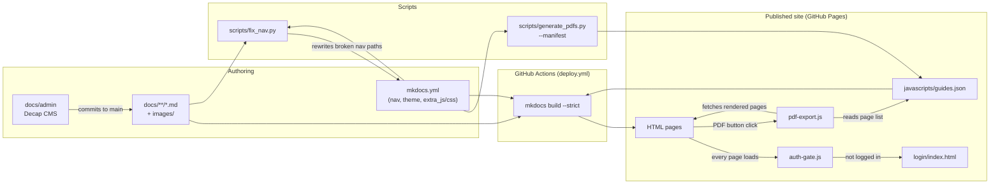
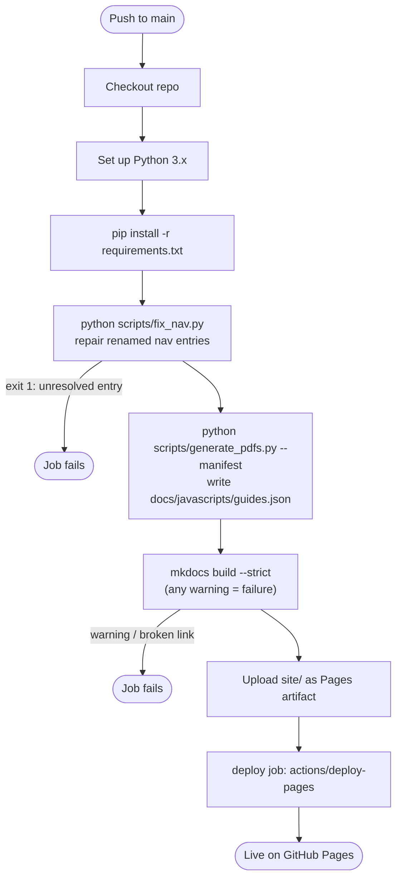
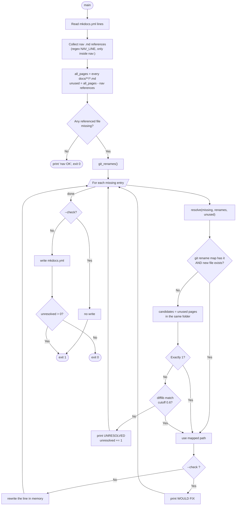
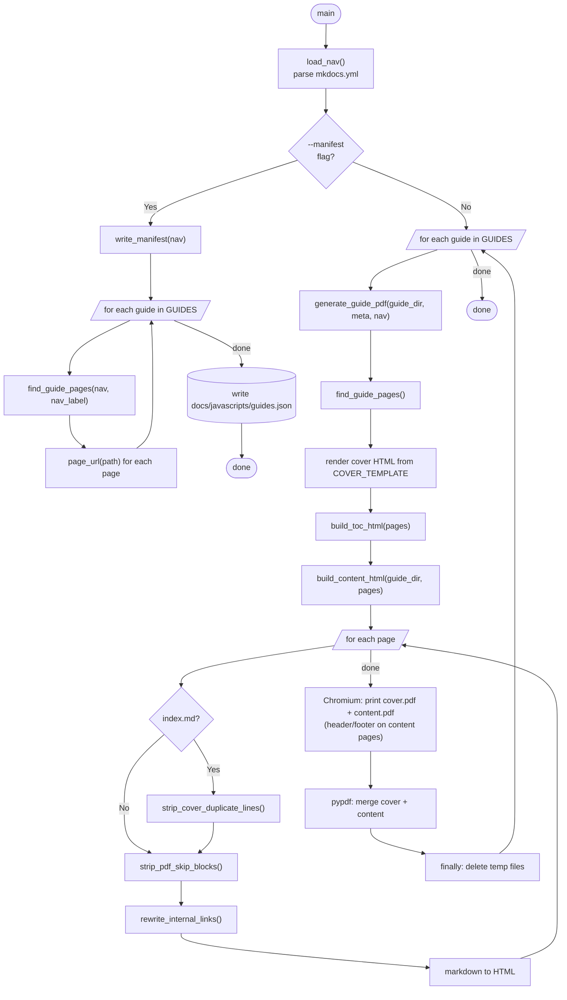
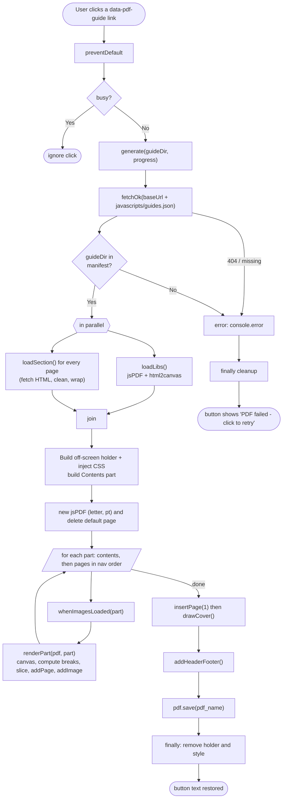
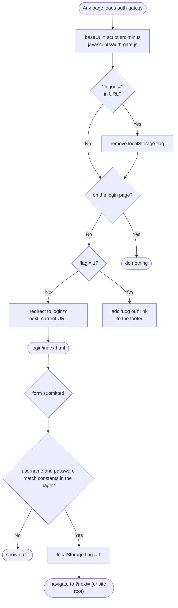

# Cisco + Nutanix CPOC Lab Guides

Source for the **Cisco + Nutanix Customer Proof of Concept (CPOC)** lab-guide website. It is a
[MkDocs](https://www.mkdocs.org/) + [Material](https://squidfunk.github.io/mkdocs-material/) static
site, deployed to GitHub Pages by GitHub Actions on every push to `main`.

Three guides are published:

| Guide | Folder | Nav section label in `mkdocs.yml` |
|---|---|---|
| Intersight Managed Mode (IMM) | `docs/imm-ahv/` | `Intersight Managed Mode (IMM)` |
| Intersight Standalone Mode (ISM) | `docs/ism-ahv/` | `Intersight Standalone Mode (ISM)` |
| Cisco Unified Edge | `docs/unified-edge/` | `Cisco Unified Edge` |

Everything is plain Markdown. There is no database and no server: the site is built once, and all
dynamic behaviour (login gate, PDF export) runs in the visitor's browser.

---

## Contents

1. [Repository layout](#1-repository-layout)
2. [How everything connects](#2-how-everything-connects)
3. [Build and deploy pipeline](#3-build-and-deploy-pipeline)
4. [Code reference and flowcharts](#4-code-reference-and-flowcharts)
5. [How to update content](#5-how-to-update-content)
6. [How to update the index (nav, home page, PDF list)](#6-how-to-update-the-index)
7. [Required files and invariants](#7-required-files-and-invariants-checklist)
8. [Running locally](#8-running-locally)
9. [Troubleshooting](#9-troubleshooting)
10. [Known limitations](#10-known-limitations)

---

## 1. Repository layout

```
.
├── mkdocs.yml                      # Site config + NAV (the single source of truth for page order)
├── requirements.txt                # Pinned Python deps for build and scripts
├── README.md                       # This file
├── .gitignore                      # site/, caches, generated docs/javascripts/guides.json
├── .github/workflows/deploy.yml    # CI: fix nav -> manifest -> build --strict -> deploy Pages
├── scripts/
│   ├── fix_nav.py                  # Auto-repairs nav entries that point at renamed pages
│   └── generate_pdfs.py            # --manifest: writes guides.json | (no flag): static PDFs offline
├── assets/                         # Repo-level source assets (logos, original PDFs); NOT published
│   └── pdf-sources/                # Original CPOC template PDFs, kept for reference only
└── docs/                           # Everything below is published
    ├── index.md                    # Home page (guide cards + PDF buttons)
    ├── assets/                     # Published logos/favicon (+ uploads/ for CMS media)
    ├── stylesheets/extra.css       # Theme colours, .cpoc-* components
    ├── javascripts/
    │   ├── auth-gate.js            # Redirects unauthenticated visitors to /login/
    │   ├── pdf-export.js           # Builds PDFs in the browser on click
    │   └── guides.json             # GENERATED (gitignored): page list + cover metadata
    ├── login/index.html            # Standalone sign-in page
    ├── admin/                      # Decap CMS (index.html + config.yml)
    ├── imm-ahv/      *.md, images/ # IMM guide
    ├── ism-ahv/      *.md, images/ # ISM guide
    └── unified-edge/ *.md, images/ # Unified Edge guide
```

---

## 2. How everything connects



Key relationships:

- **`mkdocs.yml` nav is the master index.** `fix_nav.py` repairs it, `generate_pdfs.py` reads it to
  build `guides.json`, and MkDocs builds the site from it.
- **`guides.json` is the bridge** between the build side and the browser: `pdf-export.js` reads it
  to know which pages belong to which guide, in which order, and what the cover page says.
- **PDF buttons are links with a `data-pdf-guide` attribute** (not file links). `pdf-export.js`
  intercepts the click and generates the PDF from the live pages.
- **Every page loads `auth-gate.js`** (declared in `mkdocs.yml` `extra_javascript`).

---

## 3. Build and deploy pipeline

Defined in [.github/workflows/deploy.yml](.github/workflows/deploy.yml). Triggers: push to `main`
and manual `workflow_dispatch`.



Why each step exists:

| Step | Purpose | If skipped |
|---|---|---|
| `fix_nav.py` | A renamed `.md` file would otherwise leave a dangling nav entry and `--strict` fails the build | Deploy fails on renames |
| `generate_pdfs.py --manifest` | Produces `guides.json`, which `pdf-export.js` needs at runtime | PDF buttons show "PDF failed" |
| `mkdocs build --strict` | Fails on any warning (missing nav files, broken internal links) so a broken site is never published | Broken pages could go live |

> The fix `fix_nav.py` applies in CI only affects that run's copy of `mkdocs.yml`. **Commit the
> corrected `mkdocs.yml` afterwards** (run `python scripts/fix_nav.py` locally) so the repo stays
> correct.

---

## 4. Code reference and flowcharts

### 4.1 `mkdocs.yml`

| Key | What it does |
|---|---|
| `theme` | Material theme; dark (`slate`) and light palettes with a toggle. Features: tabs, sections, indexes, footer nav, code copy |
| `extra_css` | `stylesheets/extra.css` (colours + `.cpoc-*` components) |
| `extra_javascript` | `auth-gate.js` (login gate) and `pdf-export.js` (PDF button handler), loaded on every page |
| `markdown_extensions` | `admonition`, `attr_list` (the `{ .class attr="x" }` syntax on links), `md_in_html`, `tables`, `toc`, `pymdownx.details` |
| `nav` | **Page order and titles.** Each guide is a top-level tab; every page of a guide must be listed here |

### 4.2 `scripts/fix_nav.py` — auto-repair of nav entries

Run manually (`python scripts/fix_nav.py`, or `--check` to only report) and automatically in CI.
Exit codes: `0` = nothing left to fix, `1` = unresolved entry (or `--check` found problems).

| Function | Role |
|---|---|
| `git_renames()` | Runs `git log -M --diff-filter=R --name-status -- docs` and returns `{old_path: new_path}`, following rename chains (a→b→c gives a→c). Returns `{}` if git history is unavailable (CI uses a shallow clone) |
| `resolve(missing, renames, unused)` | Finds the new path for one missing nav entry: git rename map first, otherwise a page in the same folder not yet used in nav (the only one, or closest filename ≥ 0.6 similarity) |
| `main()` | Parses the `nav:` block of `mkdocs.yml` line by line (preserving formatting), finds entries whose file does not exist, resolves and rewrites them |



### 4.3 `scripts/generate_pdfs.py` — manifest and offline static PDFs

Two modes:

- `python scripts/generate_pdfs.py --manifest` → writes `docs/javascripts/guides.json`. **This is what CI
  runs.**
- `python scripts/generate_pdfs.py` → builds a static, text-searchable PDF per guide with
  Playwright/Chromium (needs `playwright install chromium`). Output is `docs/<guide>/<pdf_name>`.
  Not used by the site; useful for offline distribution.

Configuration lives in the `GUIDES` dict at the top of the file (one entry per guide): `nav_label`
(must match the `mkdocs.yml` section title exactly), `title`, `subtitle`, `date`, `author`,
`email`, `pdf_name`.

| Function | Role |
|---|---|
| `load_nav()` | Parses `mkdocs.yml` with PyYAML, returns the `nav` list |
| `find_guide_pages(nav, nav_label)` | Returns `[(label, path), …]` for one guide's nav section; raises `ValueError` if the label is not found |
| `slugify(relpath)` | File stem, used as the HTML anchor id for static PDFs |
| `strip_cover_duplicate_lines(text)` | Removes the leading `# Title` and the CPOC subtitle line from an `index.md` (the cover already shows them) |
| `strip_pdf_skip_blocks(text)` | Removes `<!-- pdf:skip:start --> … <!-- pdf:skip:end -->` blocks (web-only UI) for static PDFs |
| `rewrite_internal_links(text)` | Turns `[x](page.md)` links into in-PDF anchors `#page` |
| `build_toc_html(pages)` | HTML contents page for the static PDF |
| `build_content_html(guide_dir, pages)` | Reads each page's markdown, applies the three strip/rewrite helpers, converts to HTML |
| `generate_guide_pdf(guide_dir, meta, nav)` | Static mode: cover + content rendered by Chromium, merged with pypdf, temp files always cleaned up |
| `page_url(relpath)` | Source path → site URL: `imm-ahv/index.md` → `imm-ahv/`, `imm-ahv/x.md` → `imm-ahv/x/` |
| `write_manifest(nav)` | Builds the manifest dict for every guide in `GUIDES` and writes `docs/javascripts/guides.json` |
| `main()` | Dispatches on `--manifest` |



### 4.4 `docs/javascripts/pdf-export.js` — in-browser PDF generation

Runs on every page. A click on any link carrying `data-pdf-guide="<guide-dir>"` builds and downloads
that guide's PDF. No pre-built PDF is fetched or linked.

| Function | Role |
|---|---|
| top-level IIFE | Derives `baseUrl` from its own `<script src>` (works under any sub-path), defines the print CSS (`.pdfx …`, which also neutralises the site's dark theme) |
| `loadLibs()` | Lazily injects jsPDF 2.5.1 and html2canvas 1.4.1 from cdnjs |
| `fetchOk(url, what)` | `fetch` that throws a readable error on non-2xx |
| `loadSection(page, isIndex)` | Fetches one rendered page, extracts `.md-content__inner`, removes web-only UI, strips classes/inline styles (keeps `admonition`), unwraps links, absolutises image URLs, wraps in a `.pdfx` div |
| `whenImagesLoaded(el)` | Resolves once every `` in a part has loaded |
| `renderPart(pdf, part)` | Rasterises one part with html2canvas, computes page breaks between top-level blocks (never cutting an image/table unless it is taller than a page), slices the canvas and adds each slice as a JPEG page |
| `drawCover(pdf, g)` | Draws the navy cover page with jsPDF primitives from the manifest metadata |
| `addHeaderFooter(pdf)` | On pages 2+ writes the repeating header, footer and page number |
| `generate(guideDir, progress)` | Orchestrates the whole run (below) |
| click listener | Delegated handler on `a[data-pdf-guide]`: `preventDefault`, ignore if busy, run `generate`, show progress/failed text on the button |



### 4.5 `docs/javascripts/auth-gate.js` and `docs/login/index.html` — login gate

A lightweight client-side gate (see [limitations](#10-known-limitations)). State is a single
`localStorage` flag, `cpoc_authenticated`.



### 4.6 `docs/admin/` — Decap CMS (optional web editor)

`docs/admin/index.html` loads Decap CMS from unpkg; `docs/admin/config.yml` defines one collection
per guide (`folder`, `title` + markdown `body` fields) and commits straight to `main`
(`publish_mode: simple`). Setup requirement: replace `base_url:
https://REPLACE-WITH-YOUR-WORKER.workers.dev` with your GitHub OAuth proxy, and confirm `repo:`.
Until `base_url` is set, the CMS cannot authenticate.

> The CMS edits `title` + `body` only. It does **not** update `mkdocs.yml` nav, so a page created
> in the CMS will not appear in the site until it is added to the nav (see §6).

### 4.7 `docs/stylesheets/extra.css`

Defines the dark palette variables (the navy page background is `--md-default-bg-color: #0a1929`)
and the reusable components used from Markdown: `.cpoc-btn`, `.cpoc-btn--outline`, `.cpoc-btn-row`,
`.cpoc-cta`, `.cpoc-cta-logos`, `.cpoc-card`, `.cpoc-tag`, `.cpoc-desc`, `.cpoc-stats`. Apply them
with `attr_list` / `md_in_html`, e.g. `[Text](page.md){ .cpoc-btn }`.

---

## 5. How to update content

### Edit an existing page
1. Edit the Markdown file in `docs/<guide>/…`.
2. Commit and push to `main`. CI deploys automatically.
3. The PDF picks up the change on the next click because it is built from the live pages.

### Add screenshots
- Put images in the guide's `images/` folder, named consistently (e.g. `scenario-3-07.png`).
- Reference them with a **relative path**: ``.
- Never use absolute paths or Windows paths; `--strict` fails on missing images.

### Add a new page to an existing guide
1. Create `docs/<guide>/my-page.md`. Start it with a single `# Title`.
2. Add it to the nav in `mkdocs.yml` under the right guide, in reading order:
   ```yaml
   - Scenario 5 - New Topic: unified-edge/scenario-5.md
   ```
3. Link to it from other pages with relative `.md` links: `[Scenario 5](scenario-5.md)`.
4. Push. The manifest and PDF contents update automatically from the nav.

### Rename or move a page
1. Rename with `git mv` (keeps history so `fix_nav.py` can follow it).
2. Run `python scripts/fix_nav.py` to update the nav, then `mkdocs build --strict` to find any
   Markdown links still pointing at the old name (`fix_nav.py` repairs the nav only, not links in
   page bodies) and fix them by hand.
3. Commit all of it together.

### Delete a page
Remove the file, remove its nav line, remove links to it, run `mkdocs build --strict`.

### Add a whole new guide
See §6.3.

### Page conventions
- One `# H1` per page; sections with `##`/`###`.
- `index.md` of each guide starts with `# Title` followed by `*Cisco Global Demo Engineering Customer Proof of Concept*`
  (the PDF removes both because the cover page already shows them).
- Callouts: `!!! note "Title"` (admonition). Collapsible: `??? note`.
- Web-only UI blocks (buttons, call-to-action bars) should sit inside `<!-- pdf:skip:start --> … <!-- pdf:skip:end -->`
  for the offline static PDFs, and use the `.cpoc-cta` / `.cpoc-btn-row` classes so the in-browser PDF
  also drops them.

---

## 6. How to update the index

"The index" is three things that must agree: the **nav** in `mkdocs.yml`, the **home page cards** in
`docs/index.md`, and each guide's **`index.md`** overview table.

### 6.1 Nav (`mkdocs.yml`)
- Order in the nav = order in the site sidebar = order of pages in the PDF.
- Every `.md` under `docs/` that should be public must be listed; unlisted pages are only reported by
  MkDocs as INFO and are not in the PDF.
- Paths are relative to `docs/` and use forward slashes.

### 6.2 Home page (`docs/index.md`) and guide overview (`<guide>/index.md`)
- Each guide card has a **Start** link (`imm-ahv/index.md`) and a **PDF** link written as
  `[PDF](#){ .cpoc-btn .cpoc-btn--outline data-pdf-guide="imm-ahv" }`. Keep the `(#)` target and the
  `data-pdf-guide` attribute; do not point it at a `.pdf` file.
- The scenario / screenshot counts (`<div class="cpoc-stats">`) are typed by hand. Update them when you
  add scenarios or images.
- The "What you'll do" table in each guide's `index.md` is hand-written; add a row for new scenarios.

### 6.3 Adding a new guide (checklist)
All of these are required, or the build or PDF export breaks:

1. Create `docs/<new-dir>/` with `index.md` and the pages.
2. Add a top-level nav section in `mkdocs.yml` (the section title is the `nav_label`).
3. Add an entry to `GUIDES` in [scripts/generate_pdfs.py](scripts/generate_pdfs.py) with `nav_label`
   **identical** to the nav section title, plus `title`, `subtitle`, `date`, `author`, `email`, `pdf_name`.
4. Add a PDF button on the overview and/or home page with `data-pdf-guide="<new-dir>"` (must equal the
   `GUIDES` key and the folder name).
5. Add a collection for it in `docs/admin/config.yml` if you use the CMS.
6. Run `python scripts/generate_pdfs.py --manifest && mkdocs build --strict`.

### 6.4 Changing cover details (title, date, author)
Edit the guide's entry in `GUIDES` in `scripts/generate_pdfs.py`. The manifest regenerates on the next
deploy and the PDF cover updates with it.

---

## 7. Required files and invariants (checklist)

If any of these break, the deploy or the PDF export fails. `mkdocs build --strict` is the single best
check; run it before pushing.

| Requirement | Why | Enforced by |
|---|---|---|
| Every nav path in `mkdocs.yml` points at an existing file under `docs/` | Strict build fails otherwise | `fix_nav.py` (auto), `--strict` |
| `GUIDES[...]["nav_label"]` equals the exact nav section title | `find_guide_pages` raises `ValueError` and the manifest is not written | `generate_pdfs.py --manifest` in CI |
| `GUIDES` key = folder name = `data-pdf-guide` value | The browser looks the guide up by this key | `pdf-export.js` ("Unknown guide") |
| Nav page entries are `Label: path.md` pairs (one level deep inside a guide section) | `find_guide_pages` reads exactly this shape | Convention |
| Guide index page is `<dir>/index.md` | `page_url` maps it to `<dir>/`, which `pdf-export.js` uses to strip the title | Convention |
| `docs/javascripts/auth-gate.js` and `pdf-export.js` listed in `extra_javascript` | They are the only way these features load | `mkdocs.yml` |
| `docs/login/index.html` exists | Login redirect target | `auth-gate.js` |
| Image paths relative and files present | Missing images fail `--strict` and render blank in PDFs | `--strict` |
| `requirements.txt` pins `mkdocs`, `mkdocs-material`, `pymdown-extensions`, `Markdown`, `PyYAML` (+ `pypdf`, `playwright` for static PDFs) | Reproducible builds | `pip install -r` in CI |
| `docs/javascripts/guides.json` is **generated, not committed** | Always in sync with the nav | `.gitignore` + CI step |
| No `*.pdf` linked from pages | PDFs are generated in the browser | Convention |
| Pages are served over http(s) and same-origin | `pdf-export.js` fetches pages and images with `fetch`/canvas; opening `site/` via `file://` will fail | Use `mkdocs serve` |

Pre-push routine:

```bash
python scripts/fix_nav.py
python scripts/generate_pdfs.py --manifest
mkdocs build --strict
```

---

## 8. Running locally

```bash
python -m venv .venv
.venv\Scripts\activate            # Windows  (source .venv/bin/activate on macOS/Linux)
pip install -r requirements.txt

python scripts/generate_pdfs.py --manifest   # needed once (and after nav changes) for PDF buttons
mkdocs serve                                 # http://127.0.0.1:8000
```

Test PDF export: open a guide overview page, sign in, click the PDF button, and wait for the download
(large guides with many screenshots can take tens of seconds).

Static PDFs for offline use (optional):

```bash
playwright install chromium
python scripts/generate_pdfs.py
```

---

## 9. Troubleshooting

| Symptom | Cause | Fix |
|---|---|---|
| CI fails: `A reference to 'x.md' is included in the 'nav' … not found` | Page renamed/removed, nav not updated | `python scripts/fix_nav.py`, commit `mkdocs.yml` |
| CI fails: `Aborted with N warnings in strict mode` | Broken link or missing image in a page | Read the warning, fix the path |
| CI fails: `Nav section not found: …` | `nav_label` in `GUIDES` differs from the nav title | Make them identical |
| PDF button shows "PDF failed" | `guides.json` missing (local) or 404; page fetch failed; CDN blocked | Run `--manifest`; check browser console |
| PDF has dark blocks / unreadable text | Site theme leaking into a PDF part | Keep the class-stripping and `.pdfx` overrides in `pdf-export.js` |
| Login loop | `localStorage` blocked (private mode) | Allow site storage |
| New page missing from sidebar/PDF | Not in `mkdocs.yml` nav | Add it |
| CMS cannot log in | `base_url` in `docs/admin/config.yml` is still the placeholder | Deploy an OAuth proxy and set it |

---

## 10. Known limitations

- **The login is a front-end gate, not real security.** The username and password are constants in
  `docs/login/index.html` and the "session" is a `localStorage` flag; anyone can read them from the
  page source, and the Markdown and images are public on GitHub Pages. Treat it as a speed bump. For
  real access control, host behind an authenticating proxy or use a private Pages site.
- **In-browser PDFs are image-based**: text is not selectable or searchable. The offline static mode
  (`generate_pdfs.py` with no flag) produces searchable PDFs.
- **PDF generation needs internet access** to load jsPDF and html2canvas from cdnjs.
- **`fix_nav.py` repairs the nav only**, not links inside page bodies, and in CI it cannot persist its
  change to the repo.
- Scenario and screenshot counts on index pages are maintained by hand.
- Material for MkDocs prints a warning about MkDocs 2.0; versions are pinned in `requirements.txt` so
  builds are unaffected until you choose to upgrade.
