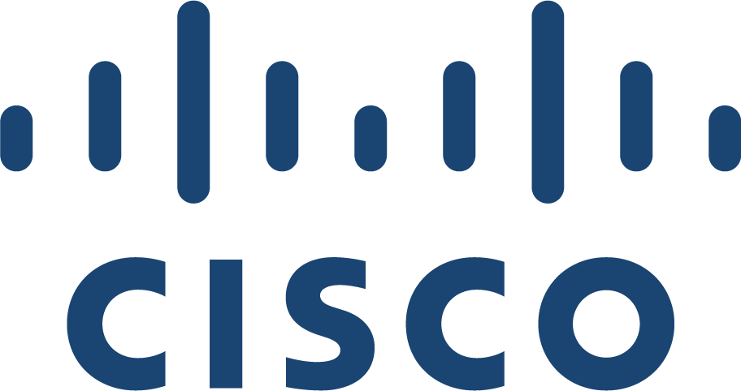

# Cisco Intersight Managed Mode – Nutanix AHV or ESX

*Cisco Global Demo Engineering Customer Proof of Concept*

**Author:** Esteban Arguedas (eargueda@cisco.com) · **Version:** 1.0 · **Last updated:** 12 March 2026

<!-- pdf:skip:start -->
[Download this guide as PDF](#){ .cpoc-btn data-pdf-guide="imm-ahv" }
<!-- pdf:skip:end -->

!!! note "Document status"
    All printed copies and duplicate soft copies of this document are considered uncontrolled. Please refer to the original, online document link for the current version.

## About this CPOC

Cisco Intersight Standalone Mode is an on-premises deployment of Cisco's infrastructure management platform that operates without requiring a connection to the Intersight cloud. When integrated with Nutanix hyperconverged infrastructure (HCI), it allows organizations to manage and monitor their Nutanix environments securely and locally.

In this mode, Intersight provides:

- Visibility into Nutanix clusters (via Prism API)
- Monitoring of VMs, hosts, and cluster health
- Management of Cisco hardware (e.g., UCS servers running Nutanix)
- Single pane of glass for hybrid environments
- Air-gapped and compliance-friendly operations

It's ideal for secure, regulated environments that require local control, while still benefiting from unified infrastructure management across Cisco and Nutanix systems.

## Scope

### Goals

After completing these scenarios, you will know how to claim, deploy and configure the Nutanix cluster with Cisco Intersight.

## What you'll do

| Scenario | Description |
|---|---|
| [Scenario 1](scenario-1-claim-servers.md) | Claim Servers and profile creation on Cisco Intersight |
| [Scenario 2](scenario-2-api-key-generation.md) | Cisco Intersight API key generation |
| [Scenario 3](scenario-3-foundation-central.md) | Onboard nodes in Foundation Central |
| [Scenario 4](scenario-4-cluster-deployment.md) | Nutanix Cluster Deployment with AHV or ESX Hypervisor |
| [Scenario 5](scenario-5-prism-central.md) | Nutanix Prism Central deployment and Cluster registration |
| [Scenario 6](scenario-6-cluster-expansion.md) | Nutanix Cluster Expansion |

See the [Environment](environment.md) page for lab IP addresses, credentials and equipment, and [Get Started](getting-started.md) to begin.

## Disclaimer

Test results are suitable to the specific design, configuration, test procedure, and types of switches deployed in the environment described in this document.

This document is provided "As-Is," without warranty of any kind, express or implied, including without limitation those of merchantability, fitness for a particular purpose, and non-infringement arising from a course of dealing usage or trade practice.

All printed copies and duplicate soft copies are not considered controlled.

### Document history

| Revision | Date | Author | Description | Version |
|---|---|---|---|---|
| 1 | 8 May 2025 | Arguedas | Intersight – Nutanix IMM use cases | 1.0 |

<!-- pdf:skip:start -->

[Start the Lab](getting-started.md){ .cpoc-btn }
[Convert to PDF](#){ .cpoc-btn .cpoc-btn--outline data-pdf-guide="imm-ahv" }

<!-- pdf:skip:end -->
