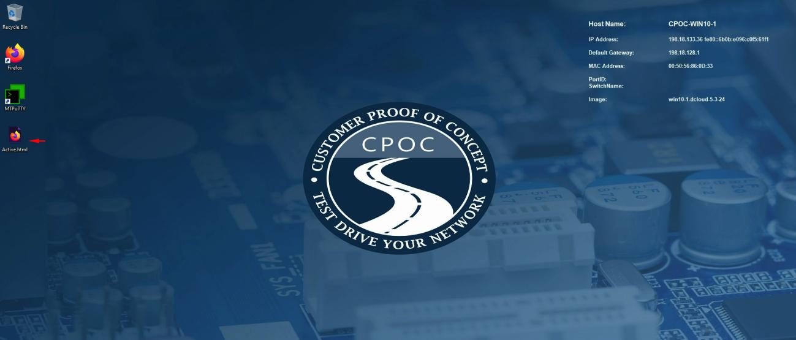
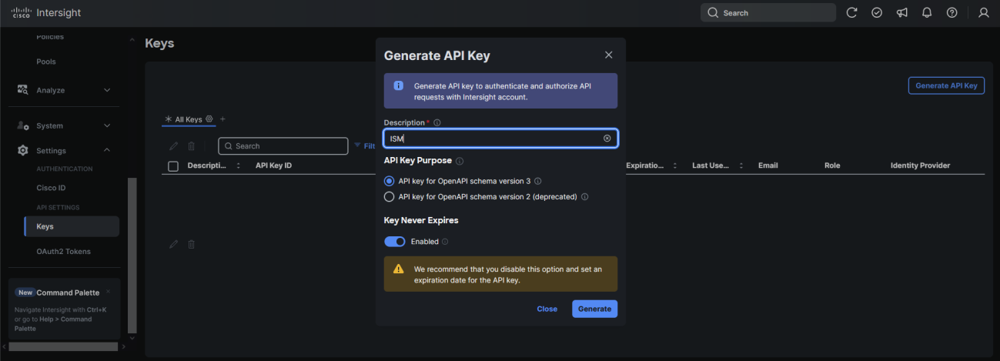
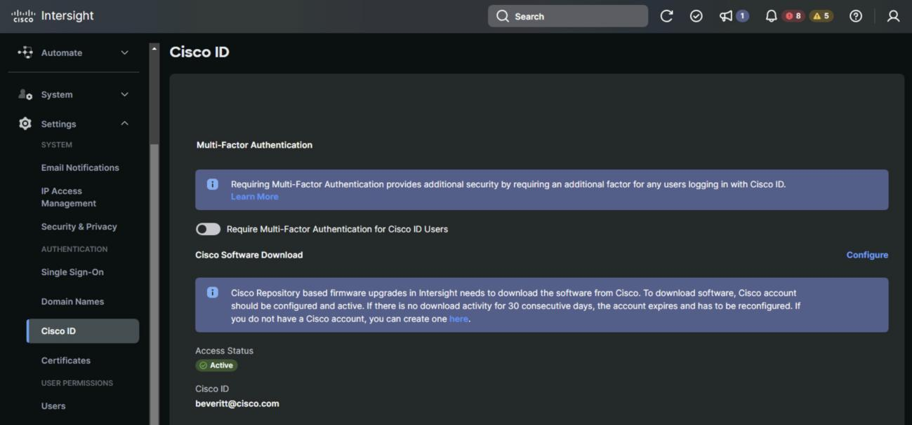

# Scenario 2 · Cisco Intersight API Key Generation

6. On the Desktop click the Active.html icon to access the Intersight login, on the next page click on the Hyperlink “Click here to login”

7. In the resulting window click Go to intersight, this will do the auto-login
!!! note
    If require accessing Intersight from the cpoc-win10-2, copy the URL and paste on the second windows virtual machine, then click Go to Intersight

8. On the left page of Intersight, under Settings, click Keys
9. Click “Generate API key” using schema version 3 for use by Nutanix Foundation Central. Be sure to save the Secret Key to a file. It will only be shown once

10. Save the API Key ID and Secret Key in the Desktop
11. Ensure your Cisco ID is granted access to download software from CCO. If not, click the Activate link and enter your CCO login credentials. This step is not required for an air- gapped Cisco Intersight private Virtual Appliance (PVA).

