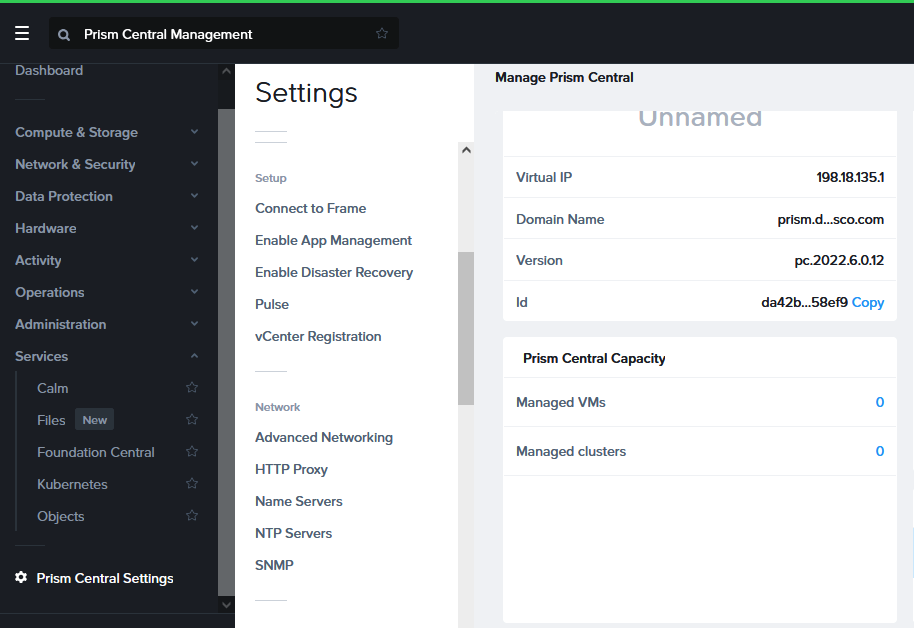
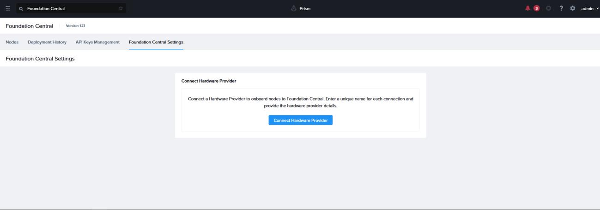
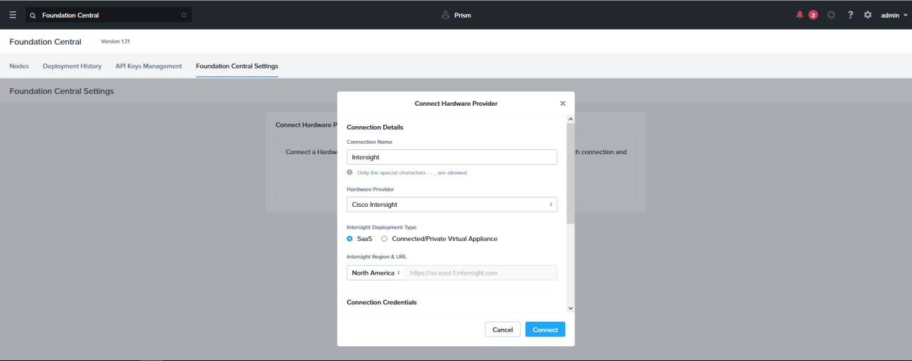
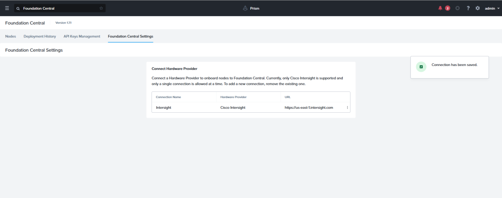
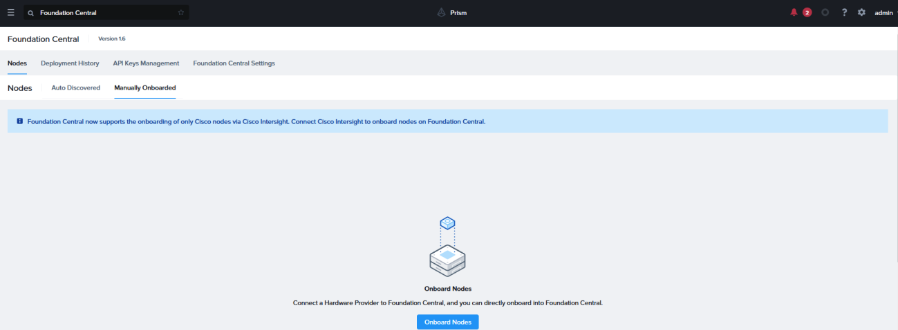
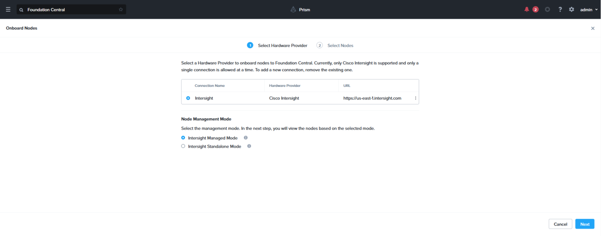
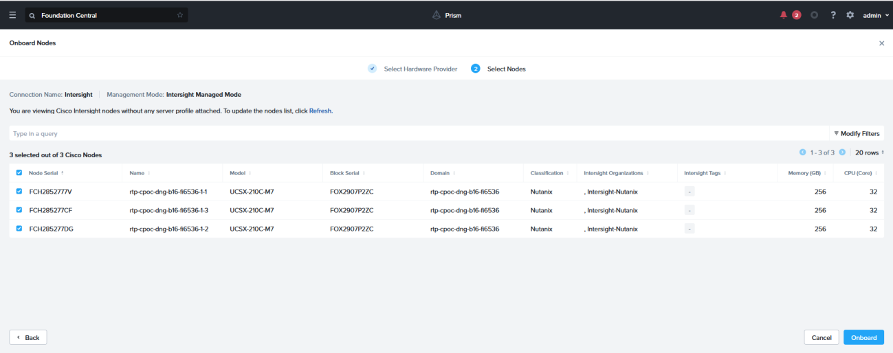

# Scenario 3 · Onboard Nodes in Foundation Central

1. On Firefox browser bookmarks click over Prism-Central-2022, the credentials are admin / C1sco12345!

2. On this lab we’re using the Nutanix Prism 2022.6.0.12 with Foundation Central 1.7.1
3. Make sure the DNS, NTP, Virtual IP and Domain Name are set.

4. Once all the parameters are confirmed, go to Foundation Central Settings to connect Prism Central with Intersight account, click “Connect Hardware Provider”

5. Fill in the required information

- Connection name= Intersight
- Hardware Provider = Cisco Intersight
- Intersight Deployment Type = SaaS
- Intersight Region & URL = North America
- Intersight API Key = <copy the one generated previously>
- Secret Key= <copy the one generated previously and saved to the desktop>

6. Prism Central will display a pop-up of “Connection has been saved”

7. Then click on Nodes > Manually Onboarded and click Onboard Nodes

8. For node management mode, choose Intersight Managed Mode then click Next

9. Select all Nodes you can to onboard and then click Onboard

