# Scenario 5 · Nutanix Prism Central Deployment and Cluster Registration

1. In the main dashboard on the Prism Central click in Register or create new

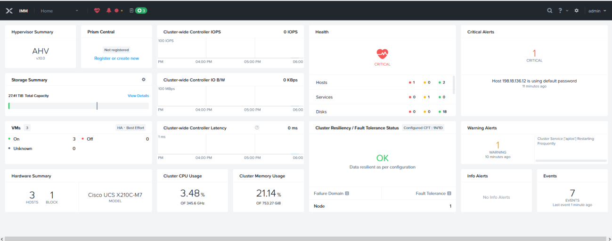

2. Select the first option, I want to deploy a new Prism Central Instance

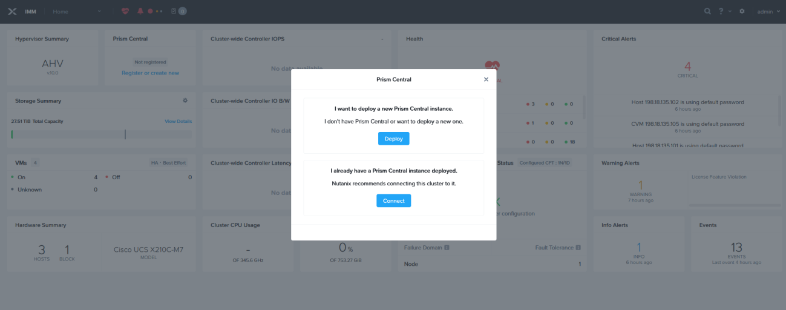

3. Under Installation Image section, select “pc.2024.3.1” and click Next

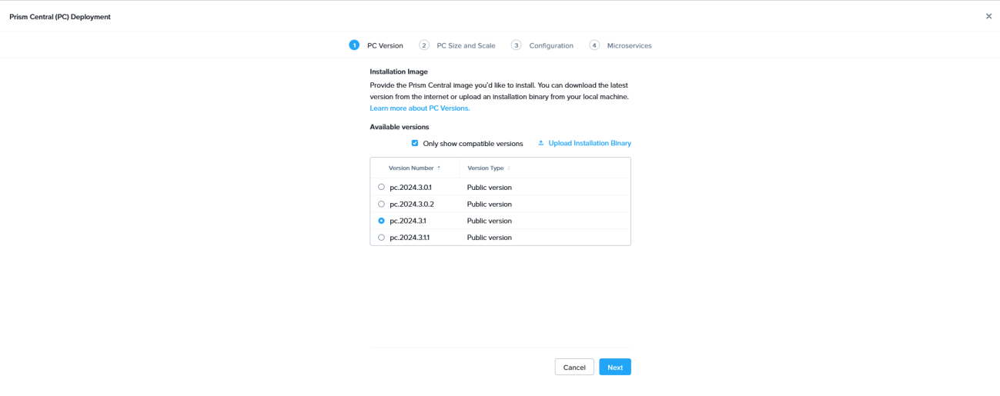

4. Select “Small” and click next
!!! note
    NOTE: Do NOT select X-Small, this option does not support cluster expansion

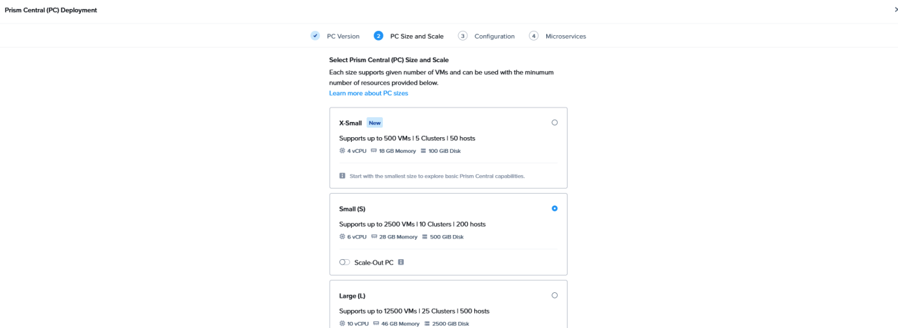

5. Add Network information:

- Network = select existing DataNetwork
- Subnet Mask = 255.255.192.0
- Gateway IP = 198.18.128.1
- DNS = 198.18.133.1
- NTP = 198.18.128.1
- Container = SelfServiceContainer
- Under General Details
- VM Name= PC-2024-3-IMM (Suggestion)
- IP Address= 198.18.136.4
- Click Next

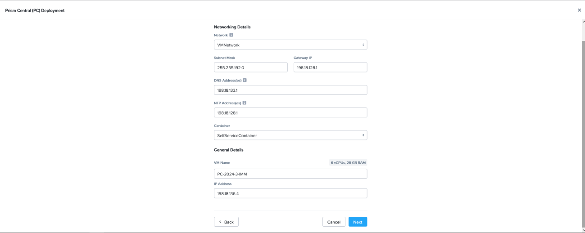

- Prism Central Service Domain Name = prism-central.cluster.local
- Internal Network = Private Network[Default]
- Click Deploy

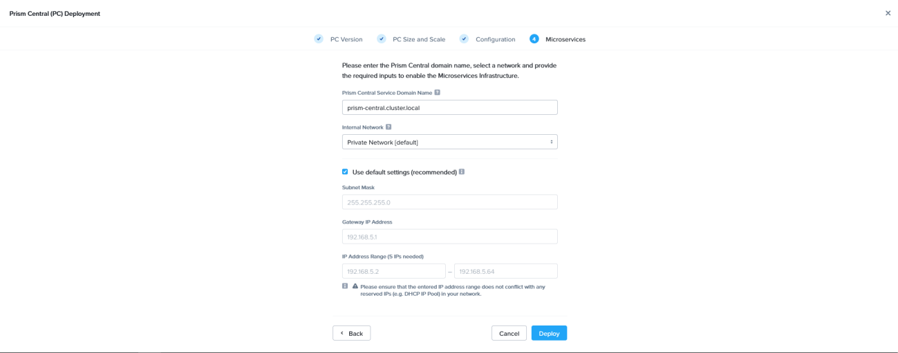

6. After the deployment begins it will take you back to the main dashboard and under the Prism Central widget you will see the deployment activity.

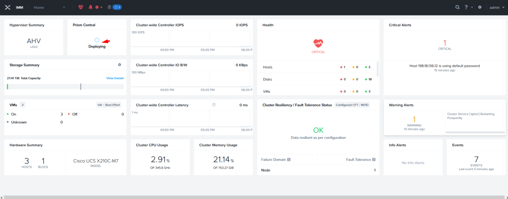

7. Once Prism Central deployment is completed, use a web browser to connect to the virtual IP assigned (198.18.136.4) and change the default

- First time logging in the credentials are:
    - Username = admin
    - Password= Nutanix/4u

- New password C1sco12345!

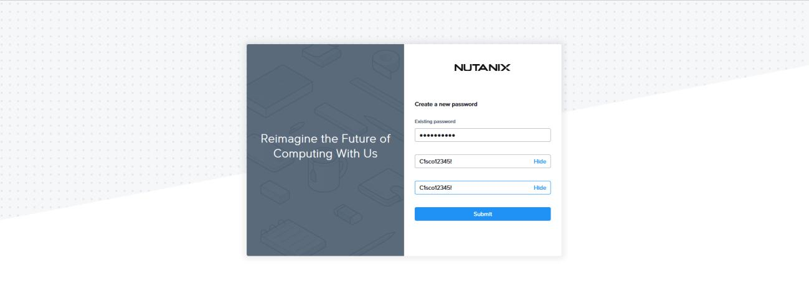

8. After the password is changed continue with the EULA

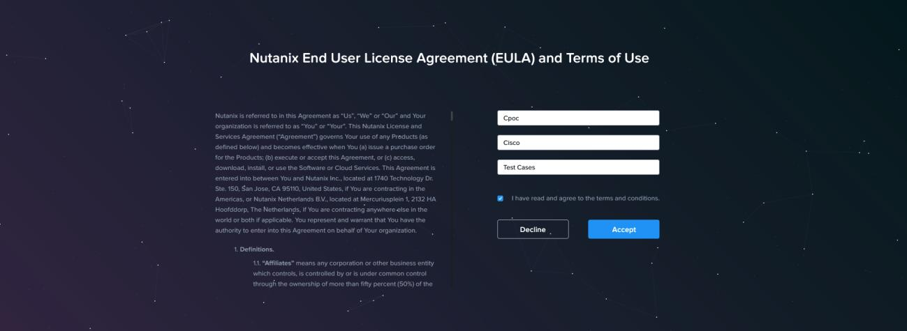

9. Keep Pulse by default and click Continue

10. At the top select Infrastructure from the drop-down, then click on Prism Central Settings, select Prism Central Management and click edit

- Cluster name = PC-VIP-IMM
- Virtual IP = 198.18.136.5
- Click Update

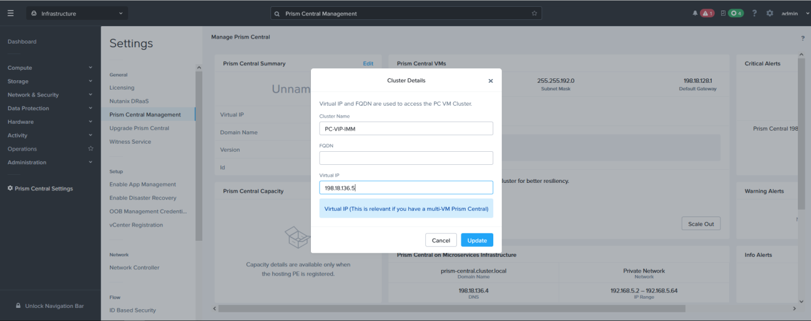

11. From the drop-down menu select Admin Center then click Marketplace and click Enable Marketplace

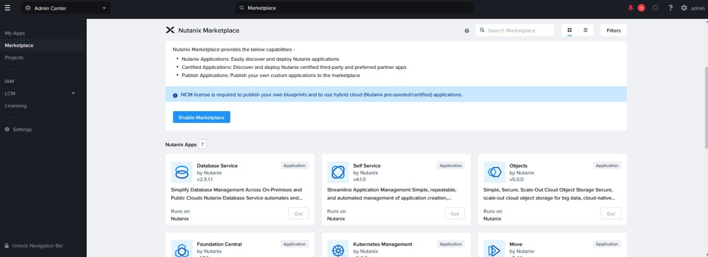

12. Once the Marketplace has been enabled, Click “Get” on Foundation Central then click Deploy

13. While the Foundation Central app is being deployed on Prism Central, return to the Prism Element main dashboard, and confirm then click “Register or create a new“

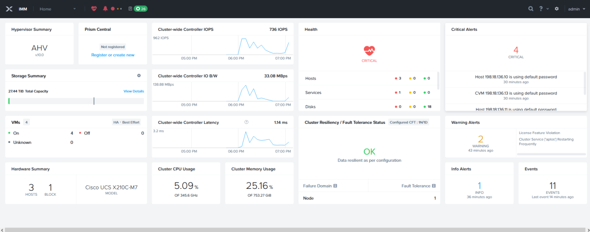

14. Now click connect and hit next

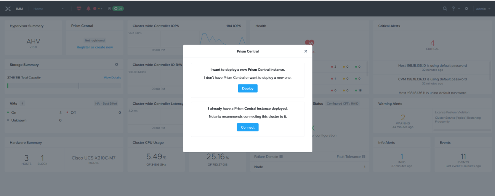

15. On the Prism Central configuration add

- Prism Central IP/FQDN = 198.18.136.5
- Username = admin
- Password = C1sco12345!
- Click Connect

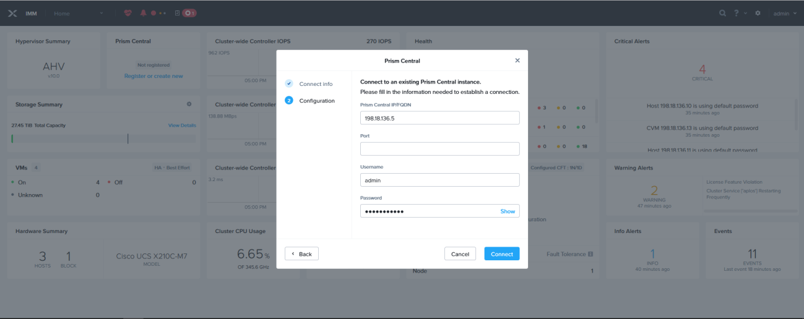

16. The IMM cluster is now registered with and connected to the new Prism Central (PC 2024.3.1)

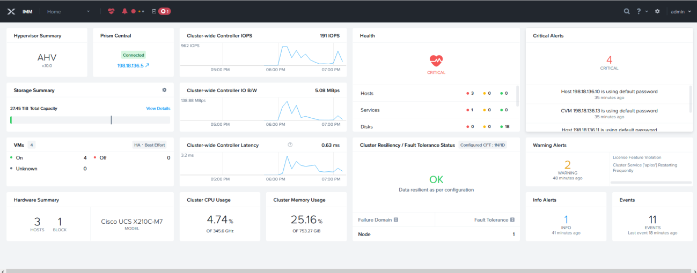
