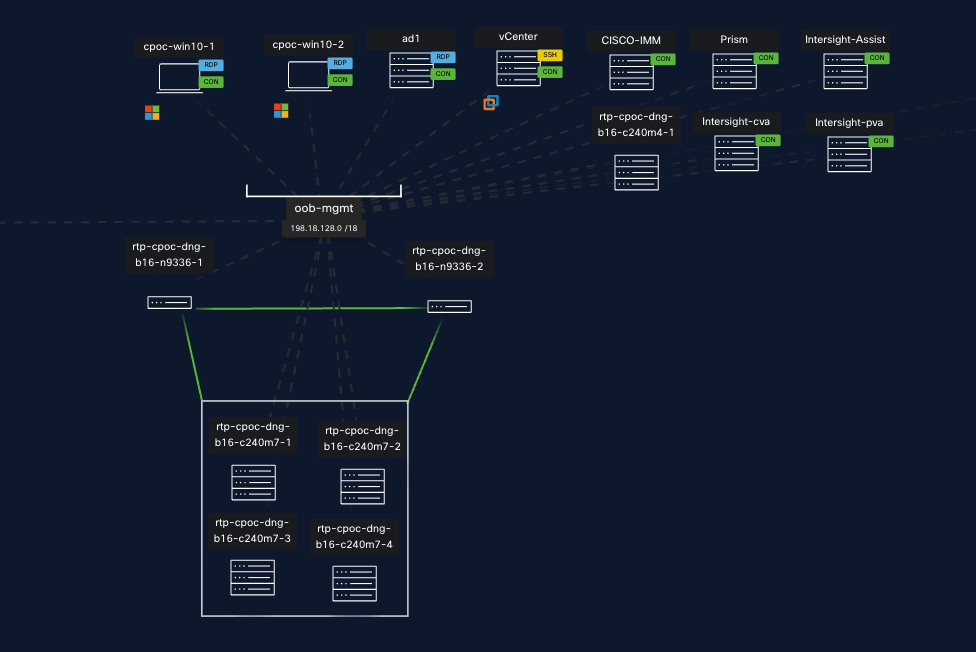
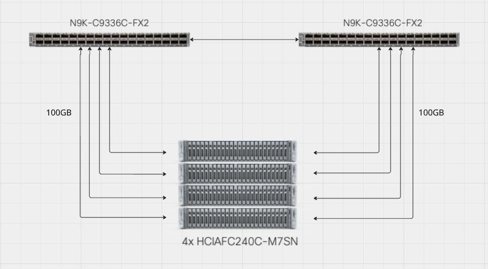

# Environment

## IP Table

| Host Name | IP Address | Credentials | Model |
|---|---|---|---|
| rtp-cpoc-dng-b16-c240m7-1 | 198.18.143.1 | admin/C1sco12345! | HCIAF240C-M7SN |
| rtp-cpoc-dng-b16-c240m7-2 | 198.18.143.2 | admin/C1sco12345! | HCIAF240C-M7SN |
| rtp-cpoc-dng-b16-c240m7-3 | 198.18.143.3 | admin/C1sco12345! | HCIAF240C-M7SN |
| rtp-cpoc-dng-b16-c240m7-4 | 198.18.143.4 | admin/C1sco12345! | HCIAF240C-M7SN |
| rtp-cpoc-dng-b16-c240m4-1 | 198.18.143.6 | admin/C1sco12345! | UCSC-C240-M4SX |
| rtp-cpoc-dng-b16-n9336-1 | 198.18.143.7 | admin/C1sco12345! | N9K-C9336C-FX2 |
| rtp-cpoc-dng-b16-n9336-2 | 198.18.143.8 | admin/C1sco12345! | N9K-C9336C-FX2 |
| rtp-cpoc-dng-b16-fi6536-1 | 198.18.143.9 | admin/C1sco12345! | HCIX-FI-6536 |
| rtp-cpoc-dng-b16-fi6536-2 | 198.18.143.10 | admin/C1sco12345! | HCIX-FI-6536 |
| cpoc-win10-1 | 198.18.133.36 | cpoc/cpoc123 | Windows 10 |
| cpoc-win10-2 | 198.18.133.37 | cpoc/cpoc123 | Windows 10 |
| Ad1 | 198.18.133.1 | dcloud/administrator/C1sco12345 | Windows server |
| Vcenter 7 | 198.18.133.30 | administrator@vsphere.local / C1sco12345! | VMWare Vsphere |
| Vcenter 8.0.3 | 198.18.133.31 | administrator@vsphere.local / C1sco12345! | VMWare Vsphere |
| Cisco IMM | 198.18.128.100 | admin / C1sco12345 | Cisco IMM Transition |
| Nutanix-pc.2022.6.0.12 | 198.18.128.150 | admin / C1sco12345! | Nutanix-pc.2022.6.0.12 |
| Intersight Assist | 198.18.128.254 | admin / C1sco12345 | Intersight |
| Intersight pva | 198.18.128.253 | admin / C1sco12345 | Intersight |
| Intersight cva | 198.18.128.252 | admin / C1sco12345 | Intersight |
| VMware-ESXI | 198.18.128.250 | root / C1sco12345! | ESX 7.0 |
| ISM Prism Element | 198.18.135.2 | admin / C1sco12345 | |
| ISM Prism Element virtual IP | 198.18.135.3 | admin / C1sco12345 | |
| ISM Nutanix PC-2024 | 198.18.135.4 | admin / C1sco12345 | |
| ISM Nutanix PC-2024 virtual IP | 198.18.135.5 | admin / C1sco12345 | |
| ISM IP Pool for cluster | 198.18.135.10-100 | | |

## Equipment – CPOC Lab

!!! note
    Be sure to include the Software Version in this table.

| Quantity Required | Model | Software Version |
|---|---|---|
| 4 | UCSC-C240-M7SN | 4.3(5.240021) |
| 2 | N9K-C9336C-FX2 | nxos10.4 |

## Design and Topology Diagram

