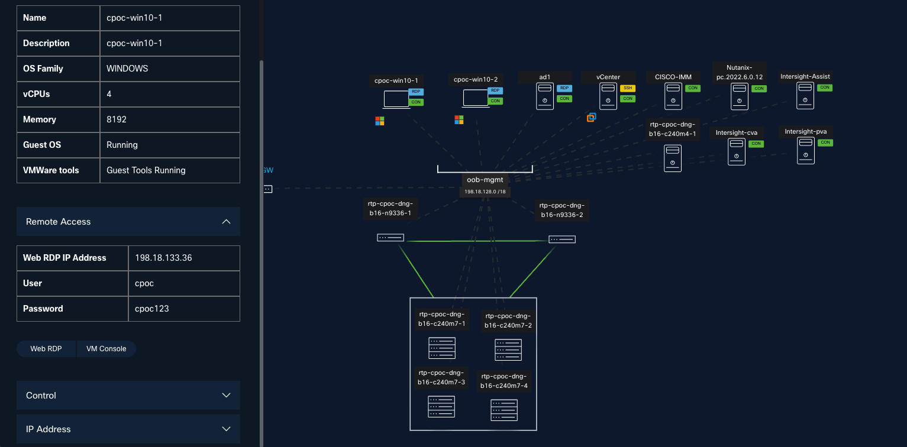
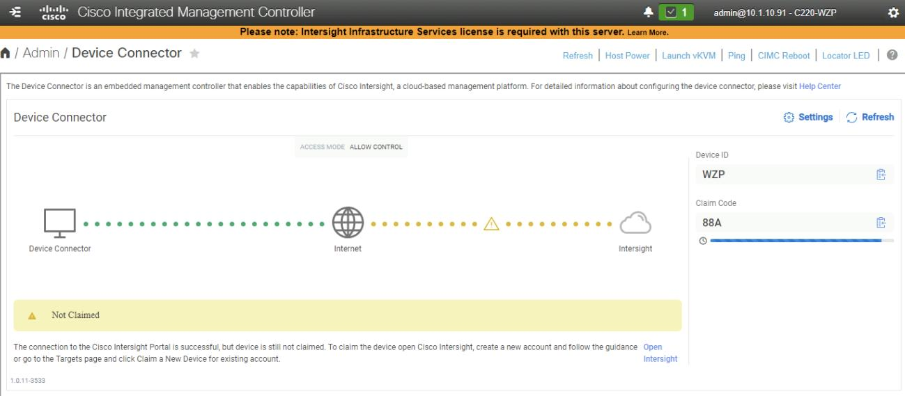
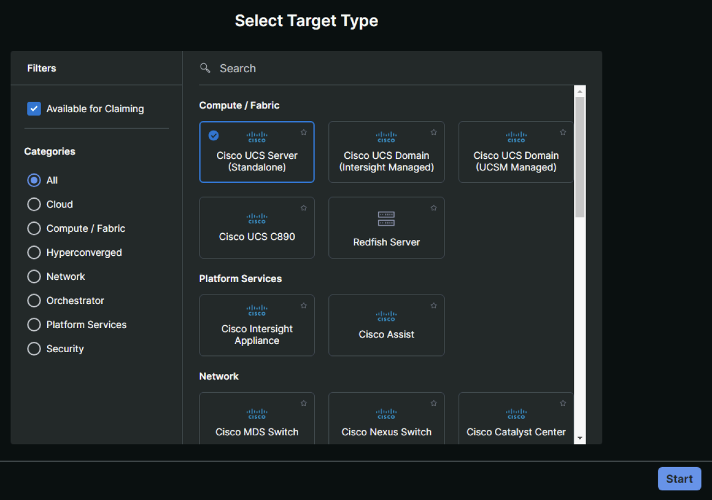
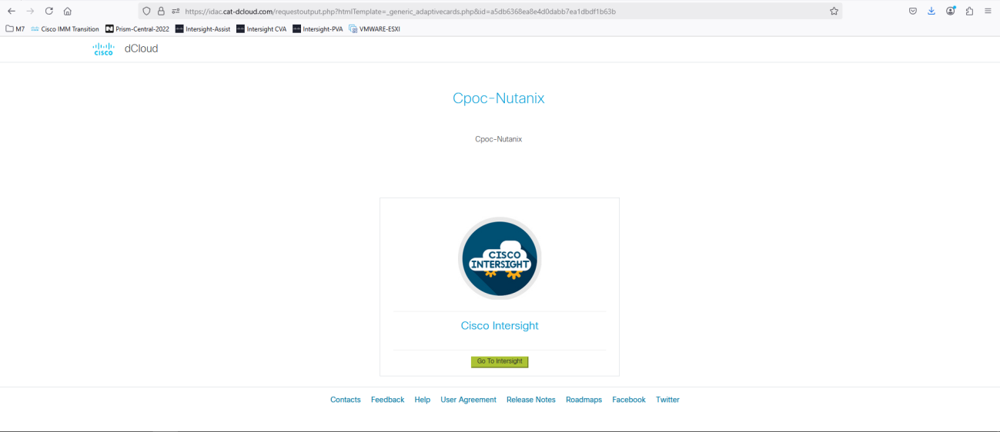
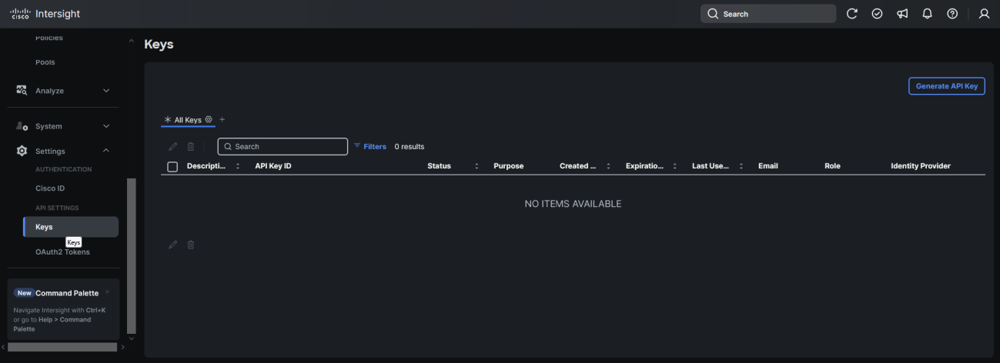

# Scenario 1 · Claim Servers in Cisco Intersight

Cisco Intersight Claim Servers is a process used to register or "claim" physical infrastructure devices (like Cisco UCS servers or Nexus switches) to the Cisco Intersight platform. Intersight is a cloud-based infrastructure management tool that provides centralized monitoring, configuration, and lifecycle management for Cisco data center hardware.

1. Click on cpoc-win10-1 on the main topology, on the left side select remote access and then click on web RDP to log in

2. Once in the workstation open firefox browser

!!! note
    NOTE: Steps from 3 to 5 have already been performed, so these are just read and view steps.

3. Log in to the CIMC interface with a web browser using the IP address you set. Retrieve the Device ID and the Claim Code from the CIMC web UI, under Admin > Device Connector

4. In Cisco Intersight, go to the System area, click on Targets, then Claim a New Target

5. Select Cisco UCS Server (Standalone), then enter the Device ID and Claim Code, then click Claim. Repeat for all the servers to be used in your new cluster

!!! note
    NOTE: When using the Cisco Intersight Virtual Appliance, the servers’ CIMC IP addresses and their usernames and passwords are used to claim the servers instead of the Device IDs and Claim Codes.

6. On the Desktop click the Active.html icon to access the Intersight login, on the next page click on the Hyperlink “Click here to login”

7. In the resulting window click Go to intersight, this will do the auto-login
!!! note
    If requires accessing Intersight from the cpoc-win10-2, copy the URL and paste on the second windows virtual machine, then click Go to Intersight

8. On the left page of Intersight, under Settings, click Keys
9. Click “Generate API key” using schema version 3 for use by Nutanix Foundation Central. Be sure to save the Secret Key to a file. It will only be shown once

10. Save the API Key ID and Secret Key in the Desktop
11. Ensure your Cisco ID is granted access to download software from CCO. If not, click the Activate link and enter your CCO login credentials. This step is not required for an air- gapped Cisco Intersight private Virtual Appliance (PVA).

