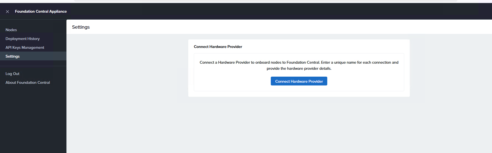
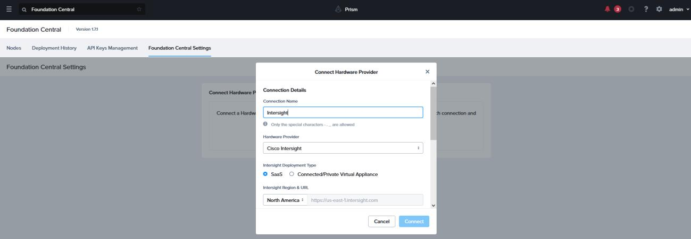
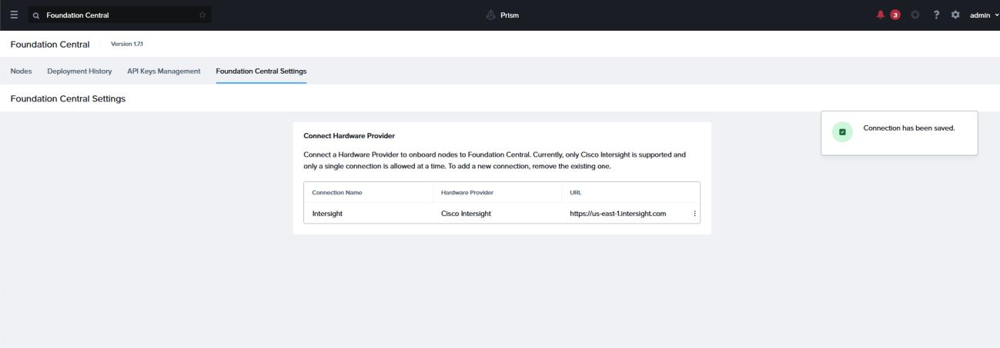
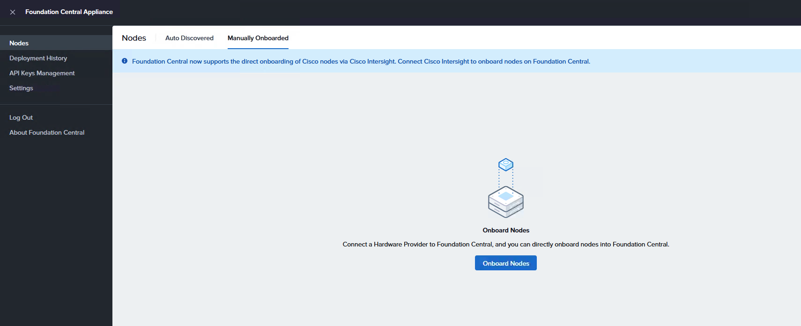
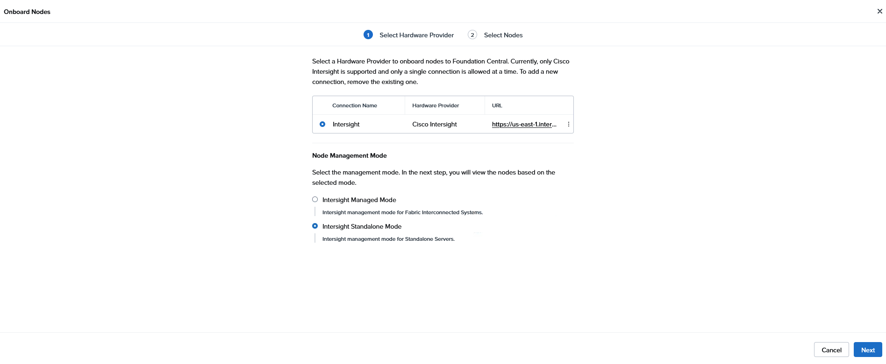
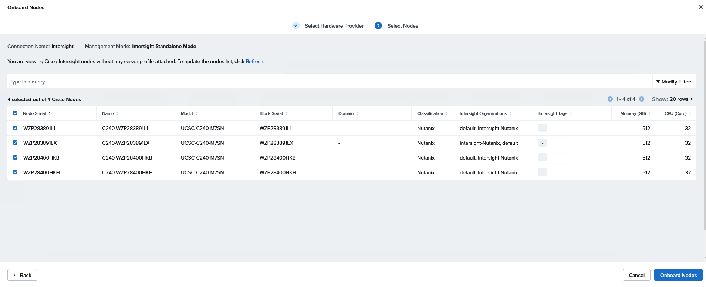

# Scenario 2 · Onboard Nodes in Foundation Central

On Firefox browser bookmarks click over Foundation-Central-1.10, the credentials are admin / C1sco12345!

On this lab we’re using the  Foundation Central 1.10
Go to Settings and click on Connect Hardware Provider

 Fill in the required information

- Connection name= Intersight
- Hardware Provider = Cisco Intersight
- Intersight Deployment Type = SaaS
- Intersight Region & URL = North America
- Intersight API Key = <copy the one generated previously>
- Secret Key= <copy the one generated previously and saved to the desktop>

Prism Central will display a pop-up of “Connection has been saved”

Then click on Nodes > Manually Onboarded and click Onboard Nodes

For node management mode, choose Intersight Standalone Mode then click Next

Select all Nodes and then click Onboard

