# Scenario 6 · Nutanix Prism Central 2022 Installation (Optional)

1. From Cisco IMM Transition, can get the PC.2022.6.0.12.ova to deploy it from zero
2. Login to Cisco IMM Transition and go to the folder Nutanix-Prism-Central and download the PC.2022.6.0.12.ova and the lcm_foundation-central_1.7.1 to the desktop

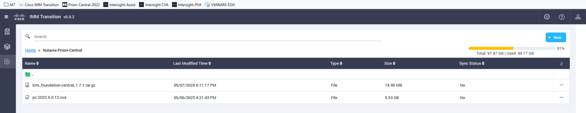

3. Open a new tab and from the bookmark click the VMWARE-ESXI and click Login.

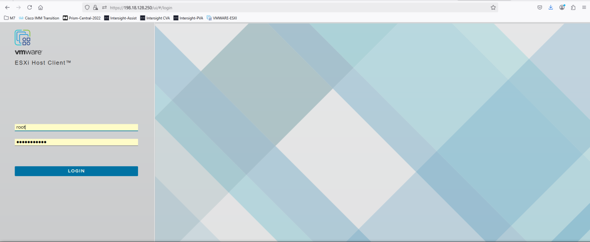

4. On the ESXI virtual Machines option, do right click and select Create/Register VM

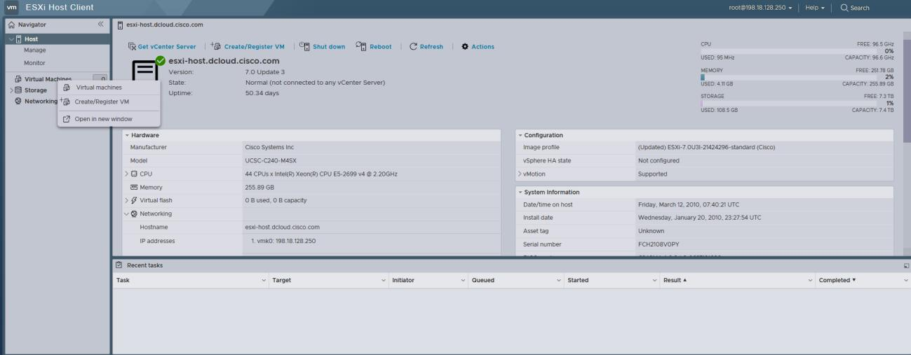

5. Then click Deploy a virtual machine from an OVF or OVA file and click Next
6. Click to select the file and go to Downloads folder to find the pc.2022.6.0.12.ova, select and click open, then add a name to the new virtual machine and click Next

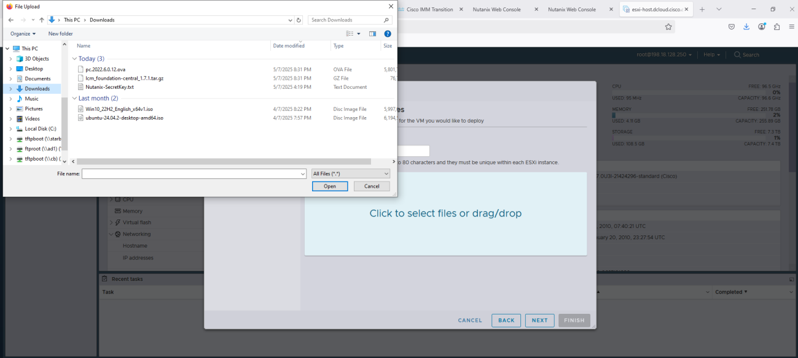

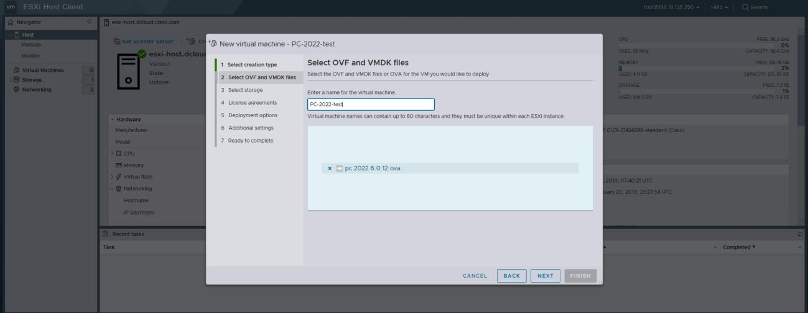

7. Select storage just click Next
8. On the Deployment options for VM Network from the drop-down menu select vmNetwork2 and click Next

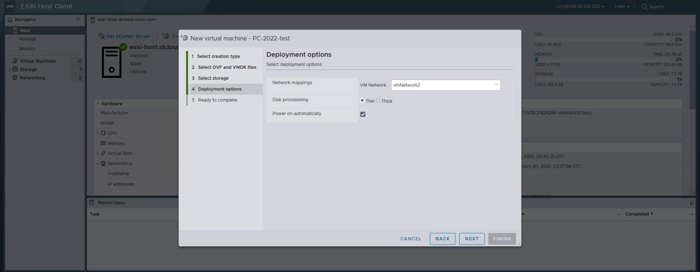

9. Then click Finish

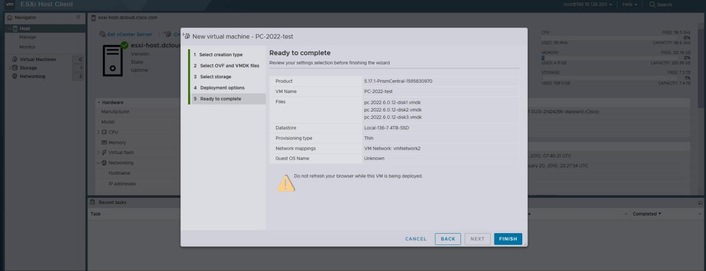

10. Power on the VM then open the local vSphere console. Let the VM run through its initial configuration steps for roughly 15 minutes, the VM will reboot multiple times.

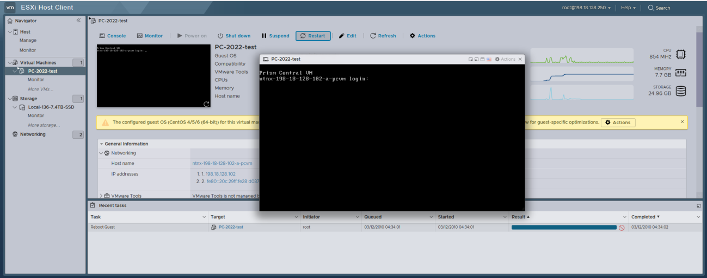

11. Log on as user: nutanix password: nutanix/4u
12. Edit the network interface with a static IP address: $ sudo vi /etc/sysconfig/network-scripts/ifcfg-eth0 Add or edit the NETMASK, IPADDR and GATEWAY lines, change BOOTPROTO to none, then save the changes= :wq! NETMASK=255.255.192.0 IPADDR=198.18.128.160 BOOTPROTO=none GATEWAY=198.18.128.1

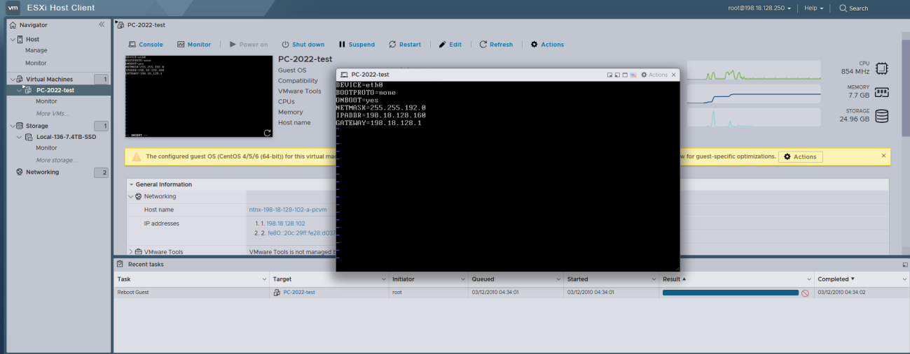

13. Edit the /etc/hosts file to remove all lines containing any entry like “127.0.0.1 NTNX-10- 3-190-99-ACVM” then save the changes and reboot: $ sudo vi /etc/hosts $ sudo reboot

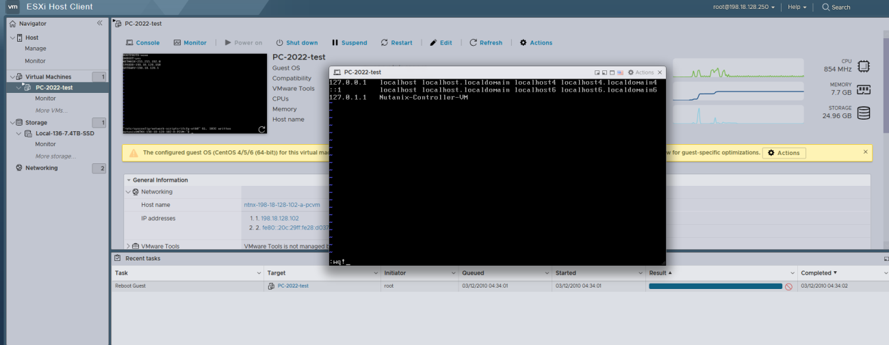

14. Log in to the Prism Central VM via SSH as user: nutanix password: nutanix/4u

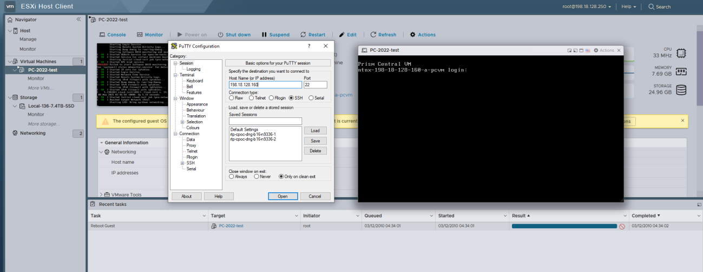

15. Run the command to create the Prism Central cluster: $ cluster --cluster_function_list "multicluster" -s 198.18.128.160 -dns_servers "198.18.133.1" -- ntp_servers "198.18.128.1" create

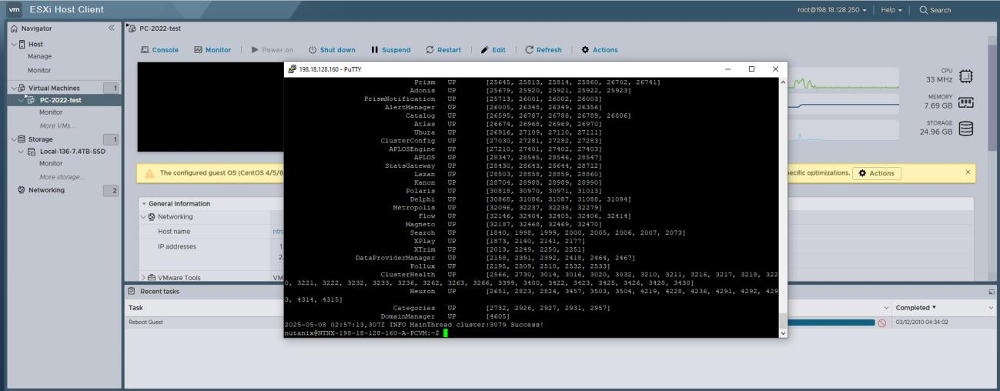

16. Log in to the Prism Central VM GUI with a web browser at https://198.18.128.160:9440 as user: admin password: nutanix/4u
17. Add a new password C1sco12345! and then log in with the new password
35. After the password has been successfully changed, login with user admin and password C1sco12345!

36. Complete the Nutanix EULA,

- Name = Cpoc
- Company = Cisco
- Job title = PC-2022
- Check the box and click accept and continue

37. Keep the Pulse option by default, click Continue

18. You should be taken to the main dashboard

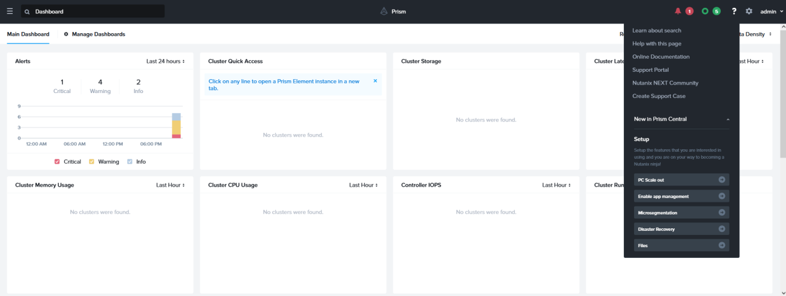

19. Click the ellipsis at the top left and select Prism Central Settings then Prism Central Management and click on Edit of the Prism Central Summary

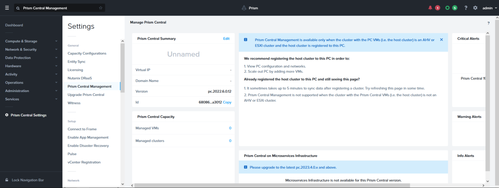

20. Add the FQDN and the virtual IP

- FQDN = prism2022.dcloud.cisco.com
- Virtual IP = 198.18.128.161
- Click Update

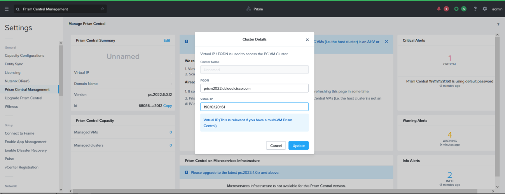

21. Confirm the Name servers and NTP Servers are set

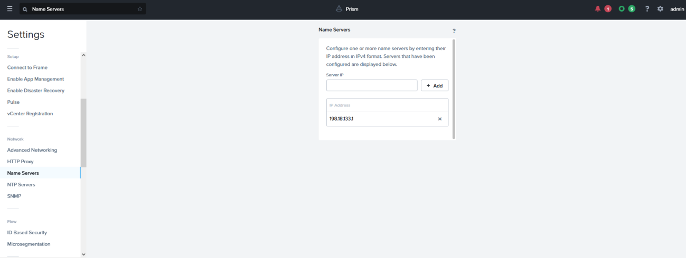

22. The Foundation Central requires an upgrade so in this case from the start menu of Windows look for WinSCP

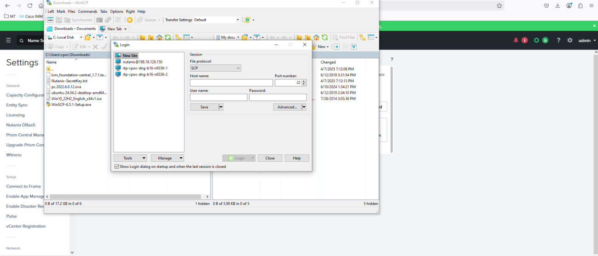

23. Click on New Site

- File Protocol = SCP
- Host name = 198.18.128.160
- User name = nutanix
- Password = Nutanix/4u
- Click login and then accept

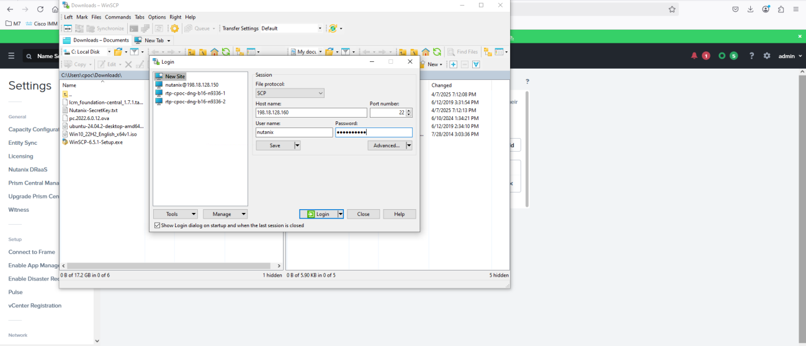

24. Drag and drop the lcm_foundation-central_1.7.1.tar.gz file from the Downloads folder to the /home/Nutanix/

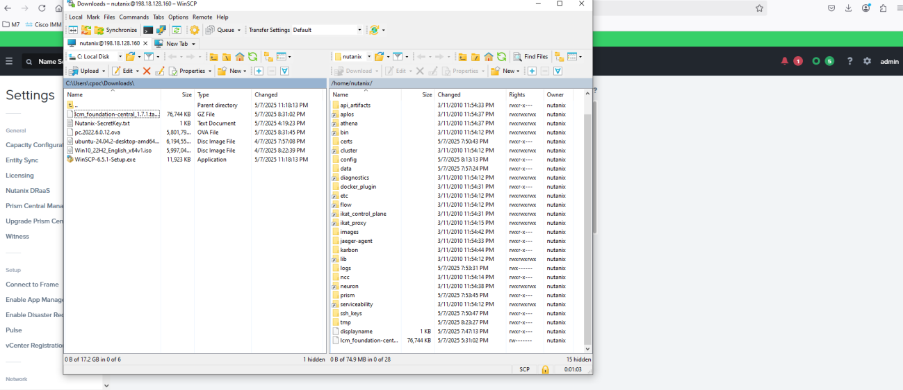

25. Then return to the Putty session and run the following commands $ mkdir /home/nutanix/fc_installer $ tar -xf /home/nutanix/lcm_foundation-central_1.7.1.tar.gz -C /home/nutanix/fc_installer/ $ genesis stop foundation_central $ sudo rm -rf /home/docker/foundation_central/* $ sudo tar -xJf /home/nutanix/fc_installer/builds/foundation-central-builds/1.7.1/foundation- central-installer.tar.xz -C /home/docker/foundation_central/ $ sudo chown -R nutanix:nutanix /home/docker/foundation_central/* $ cluster start

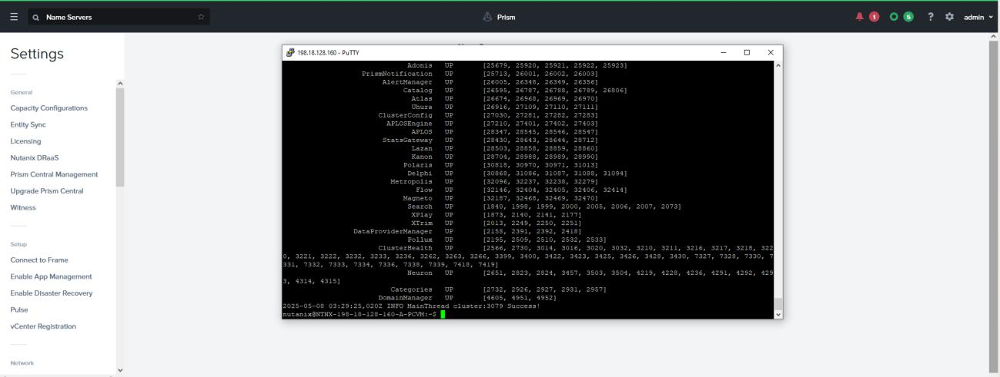

26. Return to Prism Central click the Ellipsis and select Services > Foundation Central and Click Enable Foundation Central

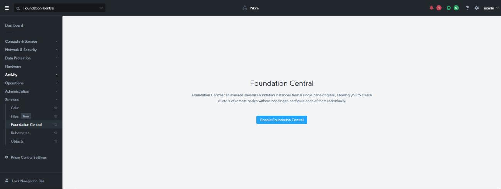

27. Then Foundation Central 1.7.1 will become available

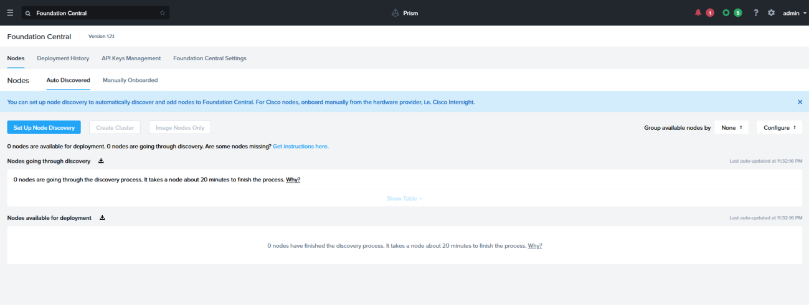

28. From here you can return to Scenario 2 and continue with the steps using your new Prism Central.