# Scenario 1 · Configure Hardware Provider

This scenario will guide you how to add the hardware provider

On the Desktop click the Active.html icon to access the Intersight login, on the next page click on the Hyperlink “Click here to login”

  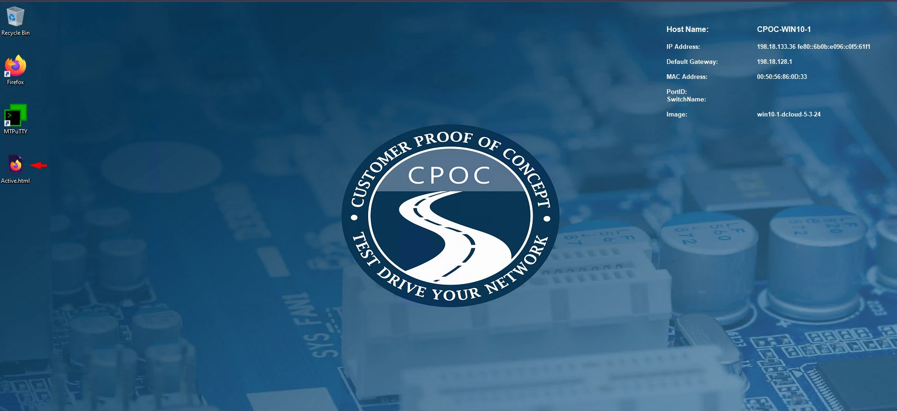

In the resulting window click Go to intersight, this will do the auto-login
!!! note
    If requires accessing Intersight from the cpoc-win10-2, copy the URL and paste on the second windows virtual machine, then click Go to Intersight

 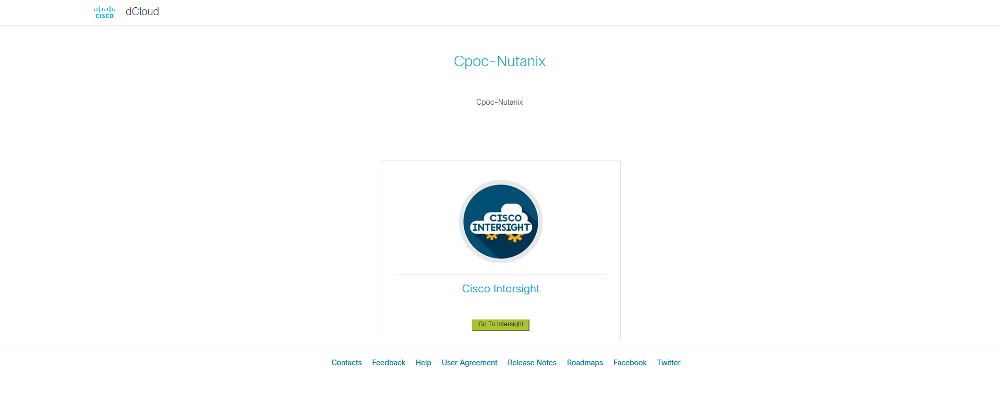

On the left page of Intersight, under Settings, click Keys
Click “Generate API key” using schema version 3 for use by Nutanix Foundation Central. Be sure to save the Secret Key to a file. It will only be shown once

 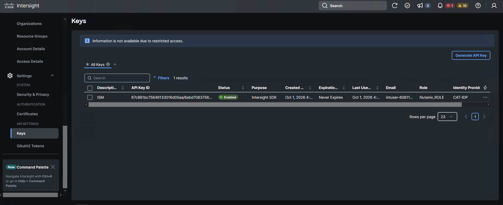

 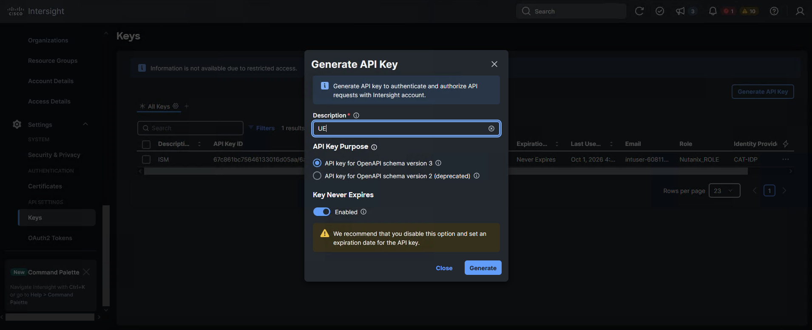

Save the API Key ID and Secret Key in the Desktop

At the top on the bookmark, click on Foundation Central 2.2

 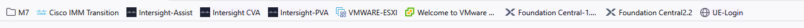

Open the Foundation Central Appliance VM GUI using a web browser at https://<FC_IP>:9440
Log in as the user “admin” using the password C1sco12345!

 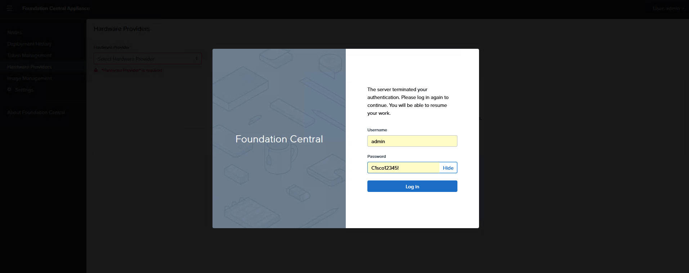

Click Hardware Providers on the left. Select Cisco Intersight from the dropdown list, then click Create Cisco-Intersight
Connection.

 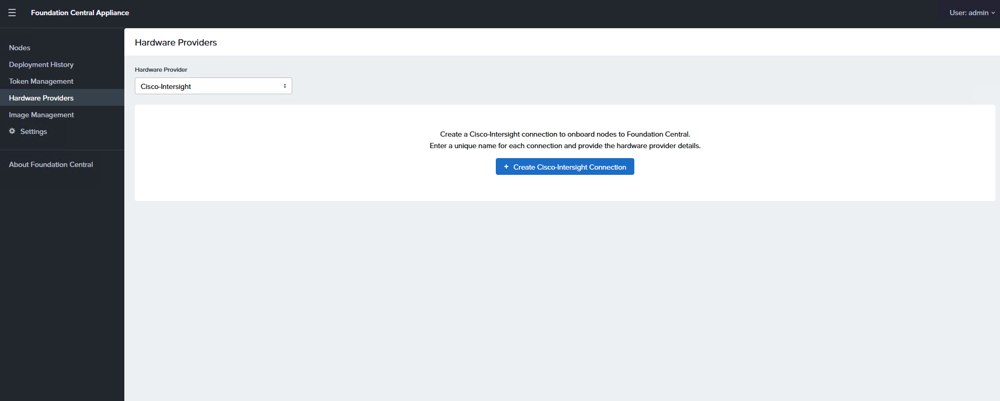

Give the connection a name, then select the deployment type; either SaaS (in the cloud) or a local CVA/PVA, then
click Next.

 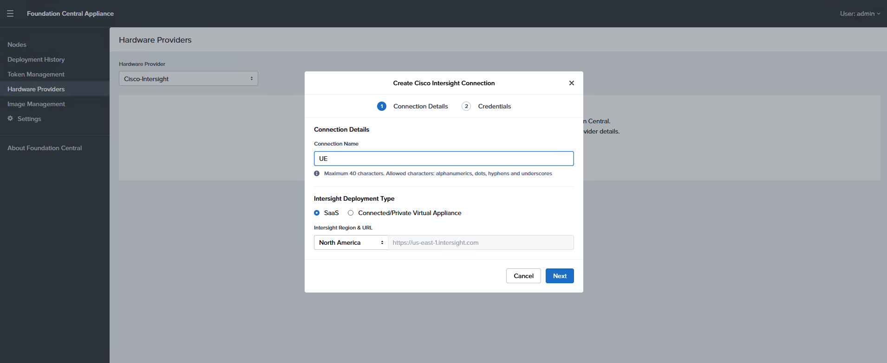

Enter the API Key ID and Secret
Key for Cisco Intersight SaaS or the CVA/PVA being used. Once the connection successfully saves nodes can be onboarded.

 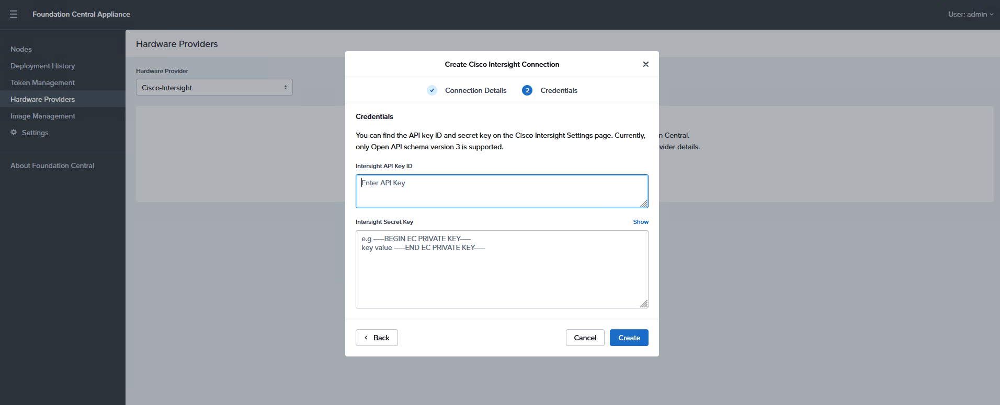

Click Image Management on the left and then click Upload Image.
    
 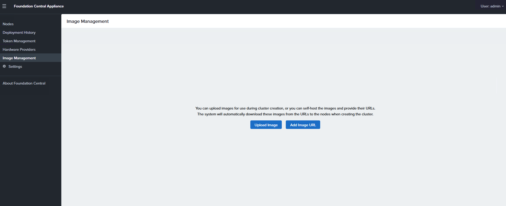
    
Where to get the images?

 

Login into Cisco IMM Transition tool, the access is located on the bookmark, In the Application click in Software Repository, you will see some folders for different versions, for this deployment, we offer the option to select one of the Nutanix AOS and the hypervisor which is supported by the servers, check the versions and select the one you like to deploy using AOS with AHV hypervisor or check below the options of VMware ESXi

 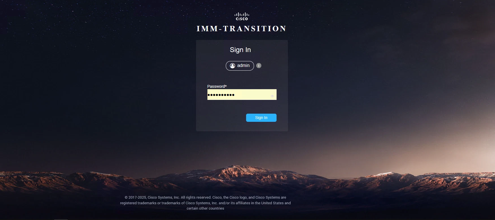

Choose one of the options to deploy the new cluster, access the desired folder and download the AOS and AHV, click the Ellipsis at the right side, then select download

 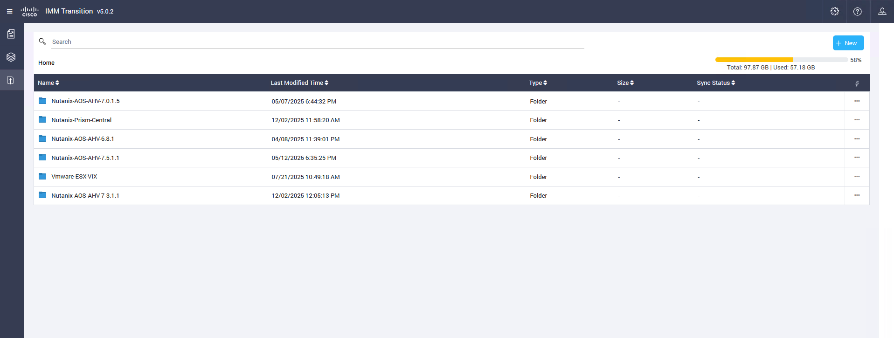
  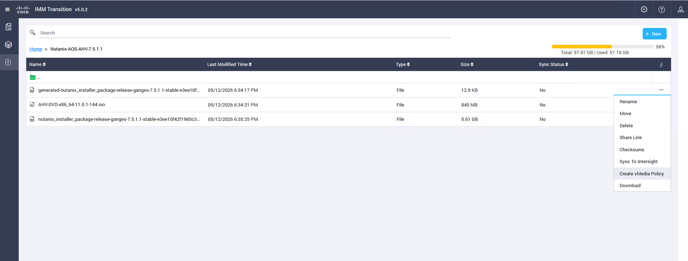

Return to Foundation Central and Select the
image type of AOS or Hypervisor and give the image a name. Select the
image file, metadata JSON or checksum then click Upload Image. Repeat the
process until a supported AOS software installer and an AHV hypervisor
installer are both uploaded.

 
 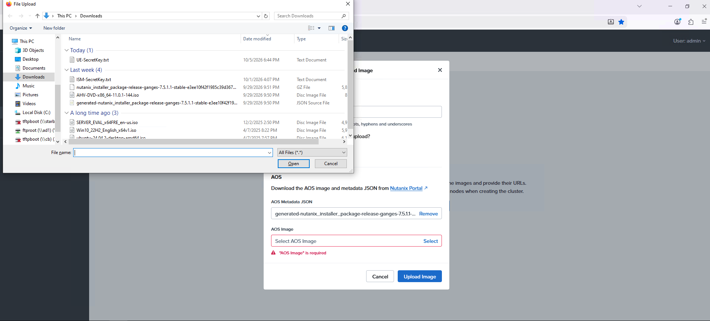

You’ll need to generate the Checksum from the IMM Transition tool for the Hypervisor OS. 

 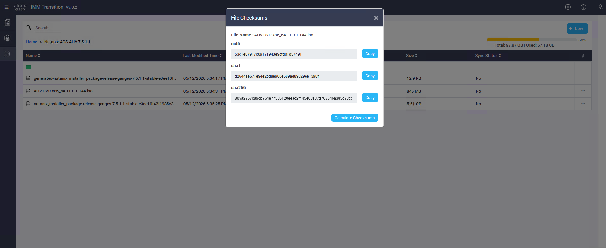
 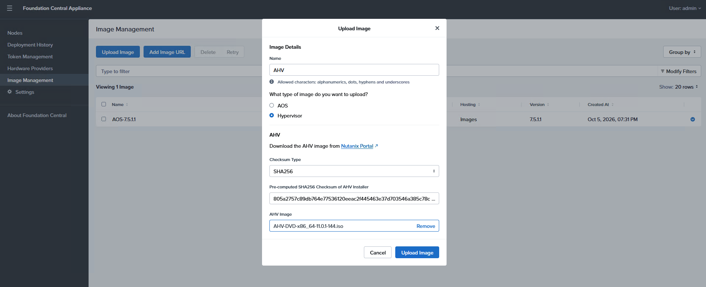

Once both are loaded should be like this example
 
 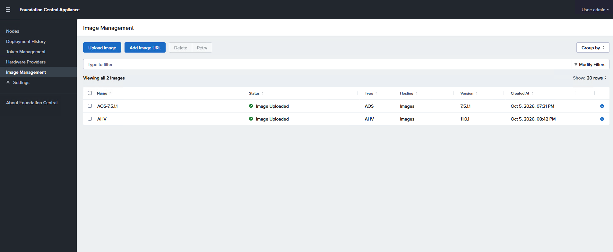

Click Nodes on the Left then click Onboard Nodes. 

  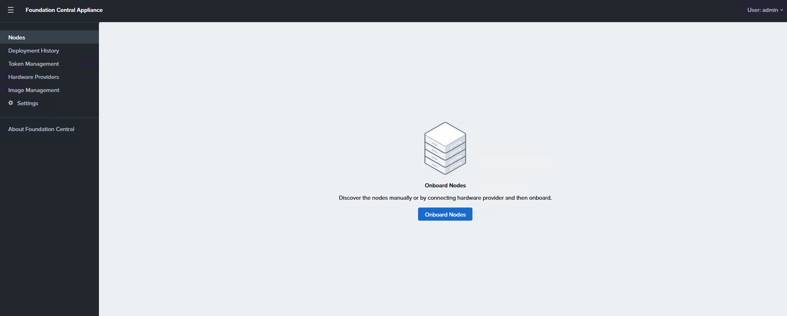

Select to onboard Via Hardware Provider, then select Cisco-Intersight from the dropdown list. Select the Intersight Connection where the new nodes for the cluster are managed, then click Next.

 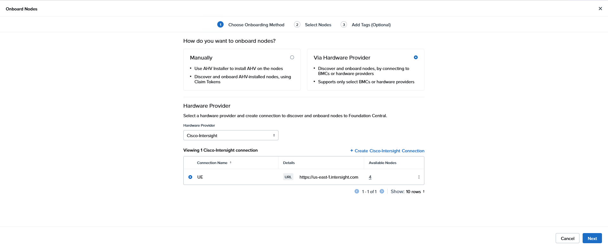

Select all nodes on the left side and click next then click Onboard Nodes

 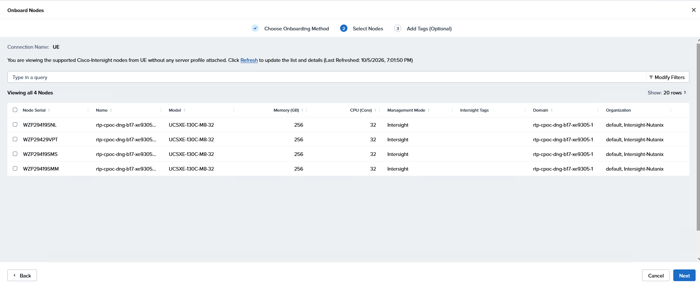
 
Once the nodes are onboarded, you’ll see a example like this 

 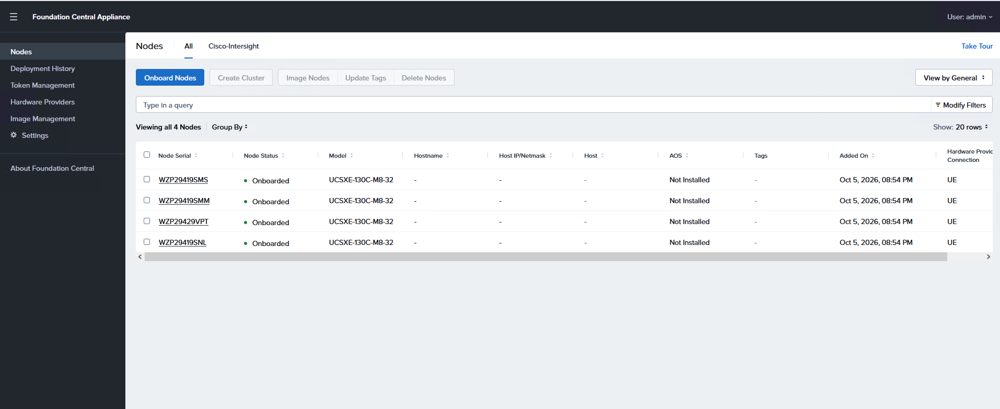
