# Scenario 2 	Nutanix Cluster Deployment with AHV or ESX Hypervisor

*TODO: replace with the real scenario content — numbered steps interleaved with screenshots, e.g.:*

In Foundation Central under Nodes select the first 3 nodes would like to use for the cluster deployment and click on Create Cluster

  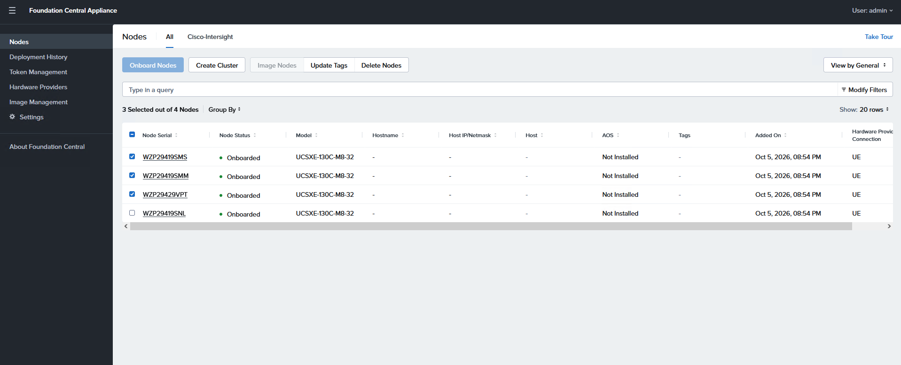

Enter the required information and click Next
    •	Name = UE
    •	Intersight Organization= Intersight-Nutanix

 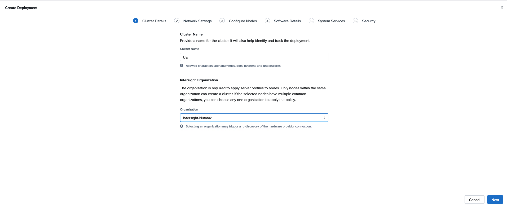

Fill in the networking information
    a.	Gateway = 198.18.128.1
    b.	Netmask = 255.255.192.0
    c.	Cluster Virtual IP = 198.18.137.2
    d.	Host and CVM VLAN = 10
    e.	Click Next

 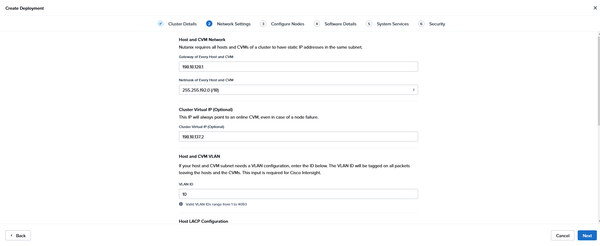
 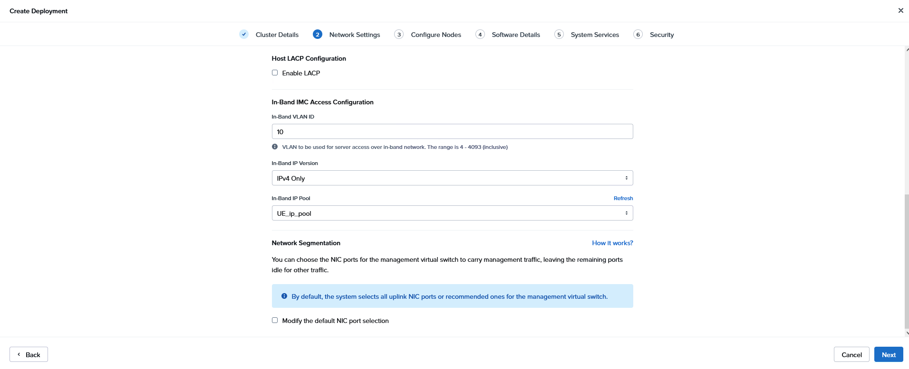

To complete the cluster Host IP, CVM IP and Host name use the image below as an example, you can choose any IP address from 198.18.137.20 up to 198.18.137.100
When adding the Host IP, skip one IP address between Host IP and CVM IP

 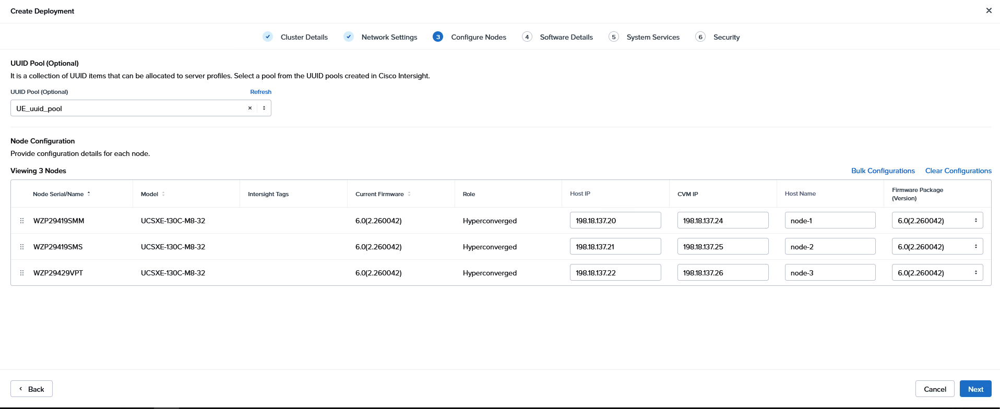

Choose to image the servers with a new version of AOS and AHV, unless the servers have been prepared from the factory with pre-installed software.

Select the AOS image and AHV image uploaded earlier, then click Next.

 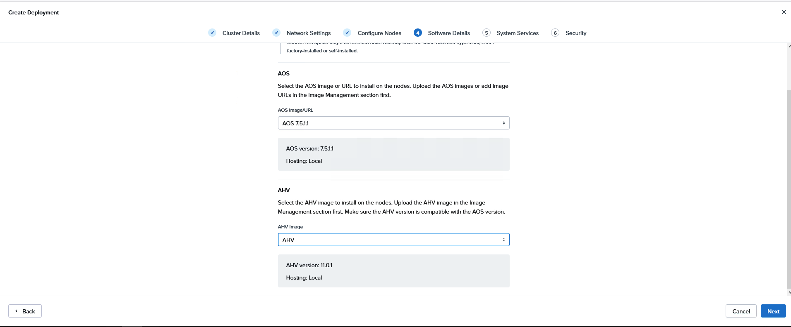

Cluster fault Tolerance select 1N/1D then, CVM Settings uses the following information
    - Timezone= America/New_York
    •	NTP=198.18.128.1
    •	DNS= 198.18.133.1
    •	Click Next

 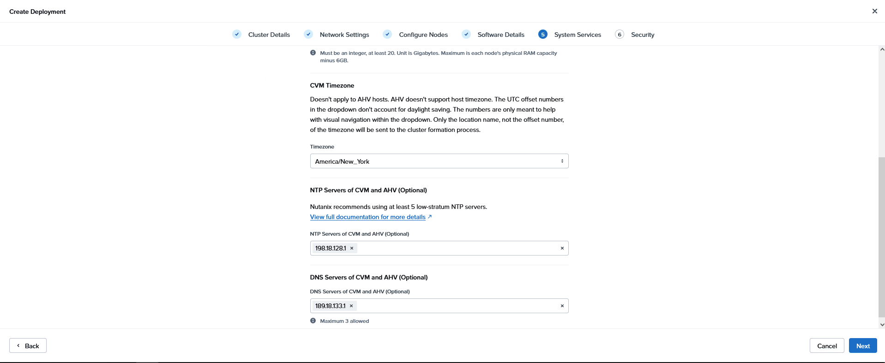

Enter a new default password for the cluster and confirm the new password. C1sco12345! And then click Create Deployment

 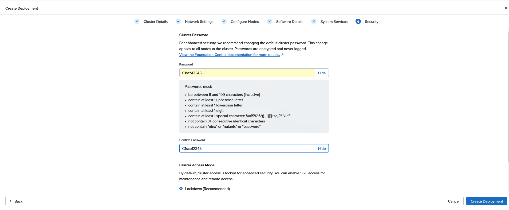

The Cluster Deployment has begun, Click on the In Progress link to see more information about the deployment and expand each phase for
additional details. Deployments without firmware upgrades/downgrades typically take 60-90 minutes to
complete. With firmware upgrades/downgrades it is common to take an additional 60-90 minutes.

 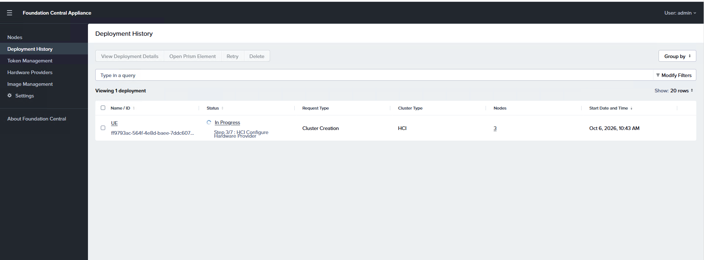
 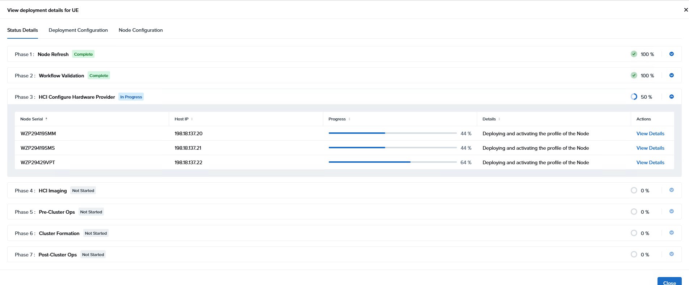

Return to Intersight, under Operate select Servers to check the Server Profile provisioning progress.

  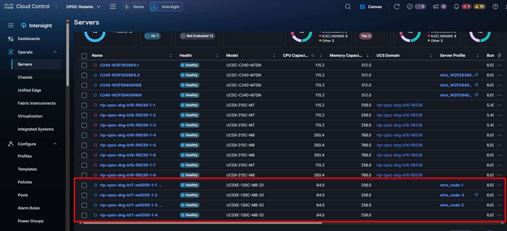