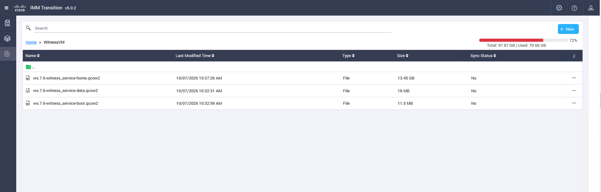

# Scenario 2 	Witness VM Installation and configuration

A Witness VM is highly recommended for 2-node clusters or clusters configured for Metro Availability
The witness VM makes failover decisions during network outages or site availability interruptions to avoid splitbrain
scenarios.
The witness VM must reside in a different failure domain from the clusters it is monitoring, meaning it has its own
separate power and independent network communication to both monitored sites.

Go to CIsco IMM Transition tool, see the bookmark or access 198.18.128.100 admin / C1sco12345, then select WitnessVM and download all content

  

Enter the required information and click Next
    •	Name = UE
    •	Intersight Organization= Intersight-Nutanix
