# Scenario 3 	Witness VM Installation and configuration (Optional)

A Witness VM is highly recommended for 2-node clusters or clusters configured for Metro Availability
The witness VM makes failover decisions during network outages or site availability interruptions to avoid splitbrain
scenarios.
The witness VM must reside in a different failure domain from the clusters it is monitoring, meaning it has its own
separate power and independent network communication to both monitored sites.

Go to CIsco IMM Transition tool, see the bookmark or access 198.18.128.100 admin / C1sco12345, then select WitnessVM and download all content

 

Return to the recent created cluster and click on Deployment Configuration, there will see the Cluster VIP 198.18.137.2

  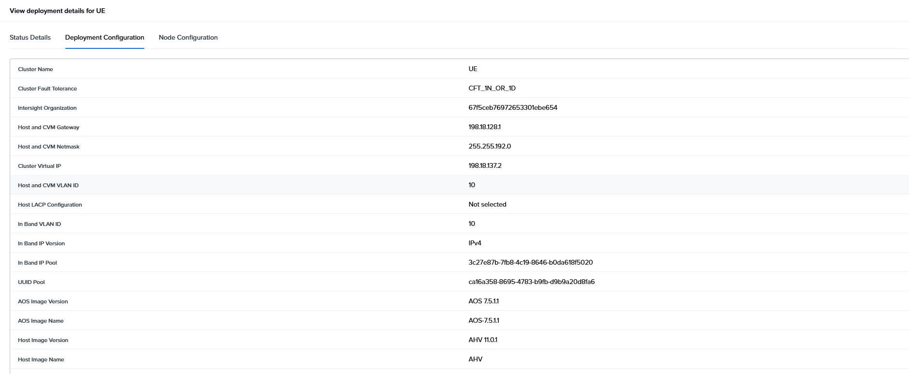

Open a new tab and login to the new Prism 198.18.137.2, admin / nutanix/4u 
Need to create a new password, use C1sco12345!

  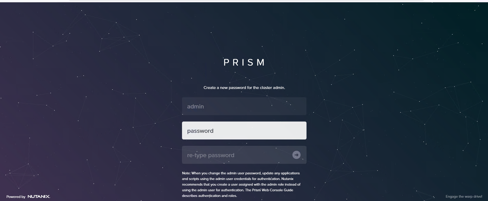

For Nutanix EULA fill the information, check the box and accept and continue
 Name= cpoc
 Company= Cisco
 Job tile= UE

  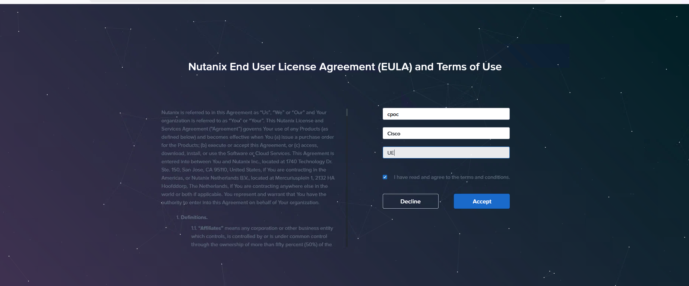

Click home at the top, then select settigns, click on Image Configuration and + upload Image

  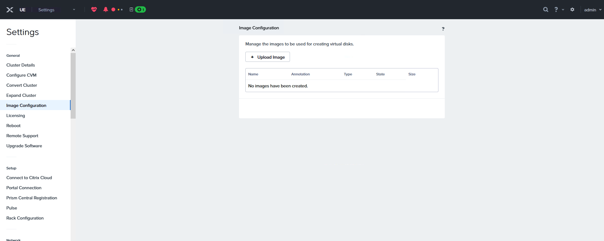

Fill the information of the new Image, 
Name= Witness VM boot
Image Type = DISK
Storage Container = SelfServiceContainer

click on Upload a file and click Browse and save

  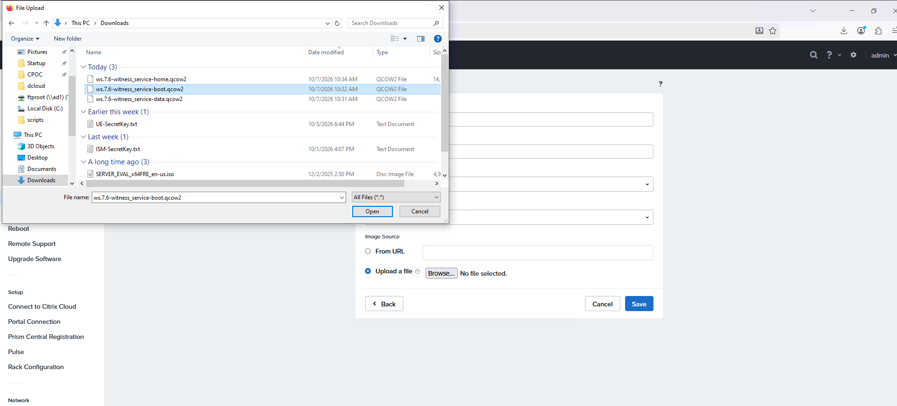

Repeat the steps to load the data and home files

  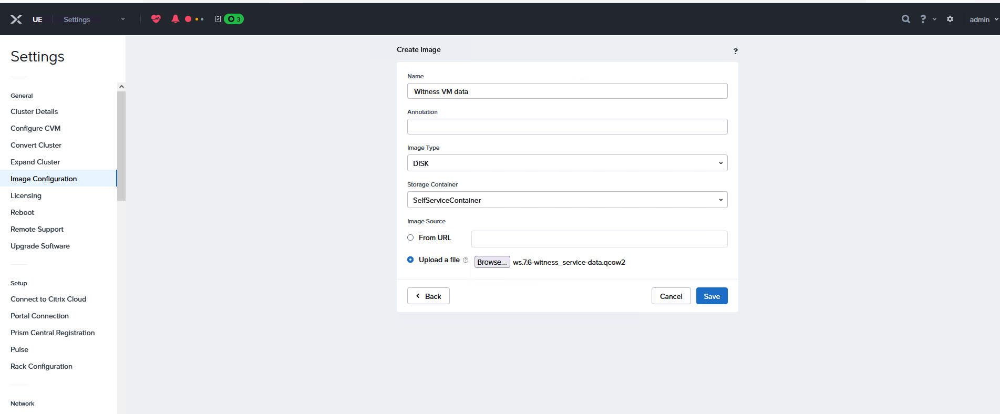
  
  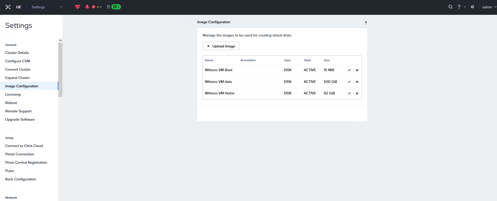

Deploy the Witness VM,
Click at the top dropdown menu and select VM, click + create VM

  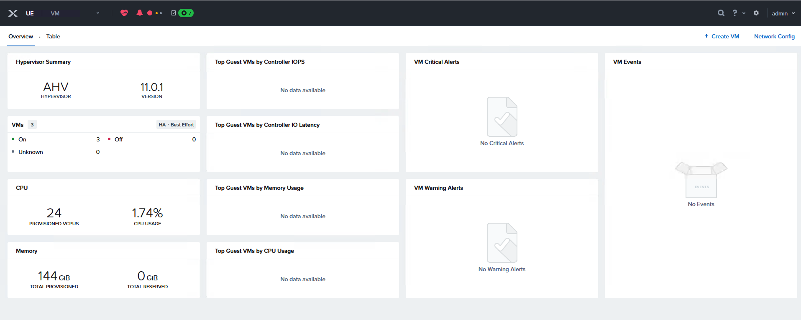

Add the name  Witness_VM_AHV, add 2 vCPUs 

  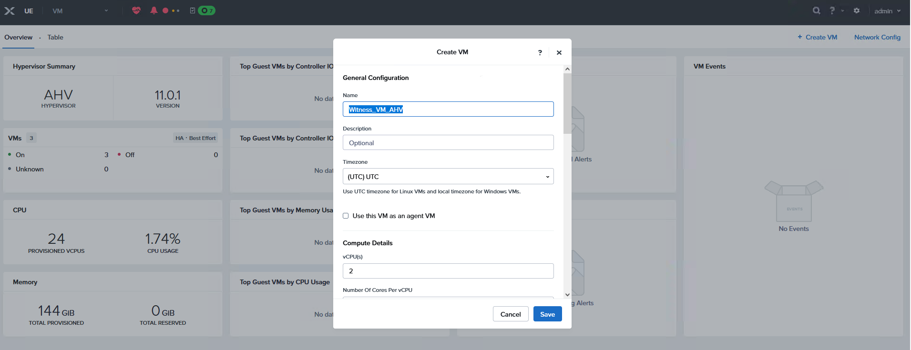

On memory add 6 Gb and select legacy BIOS 

  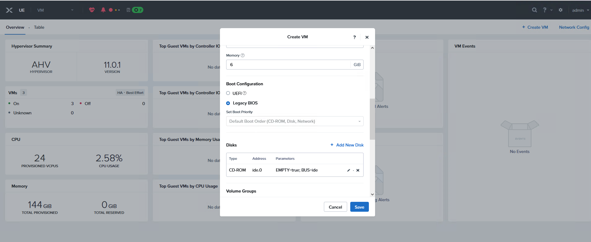

Add all the three disk images as ISCI , clone from image service
First Boot disk
Second Home disk
final Data disk

  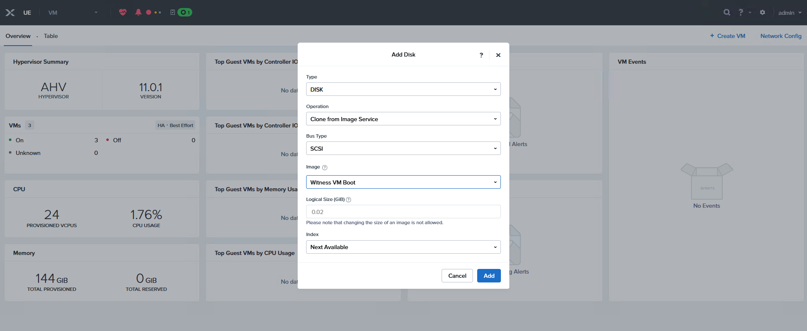
  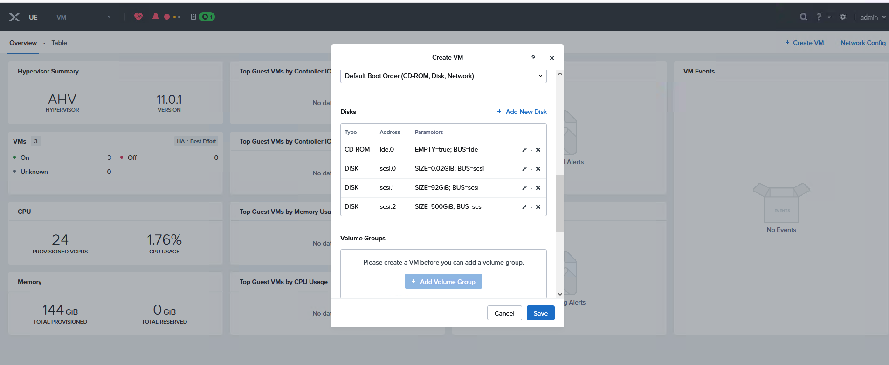

Now click on + Add New Nic, select Add Network 

  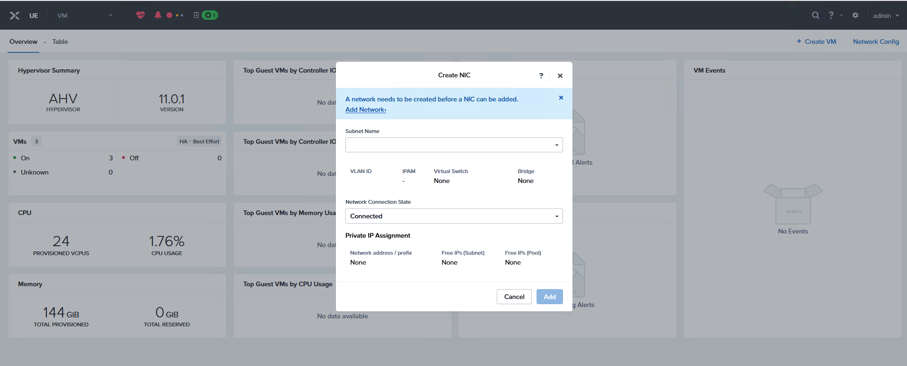

Create Subnet, Name VM_network, Virtul Switch vs0, Vlan ID 10, click Save 

  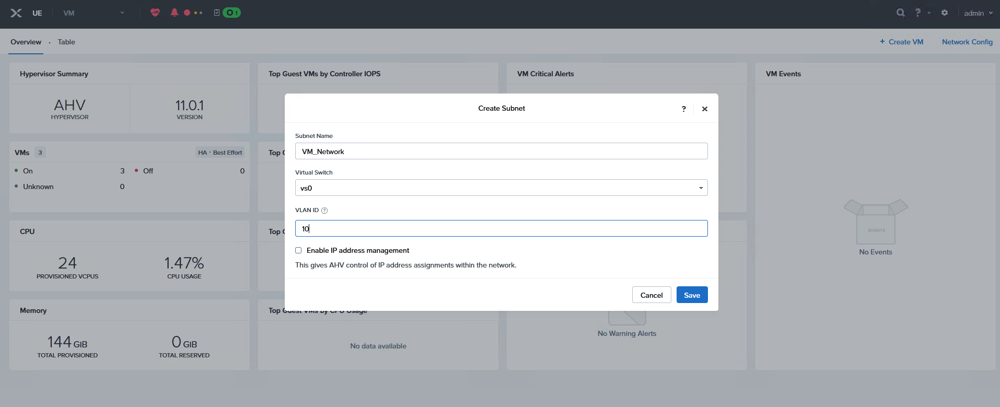

Click the x and the new subnet will be add to on the new NIC, then click add

  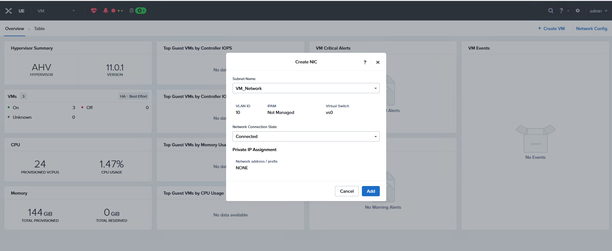

Now save the new VM and boot

  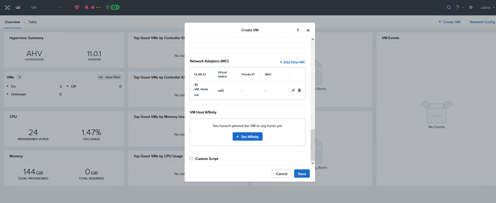

Click on table at the top left to view the new VM and power on
 
  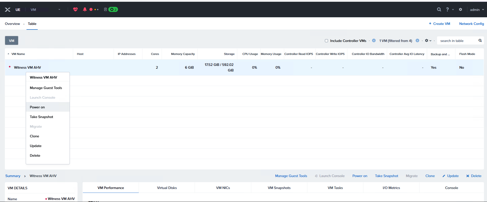

