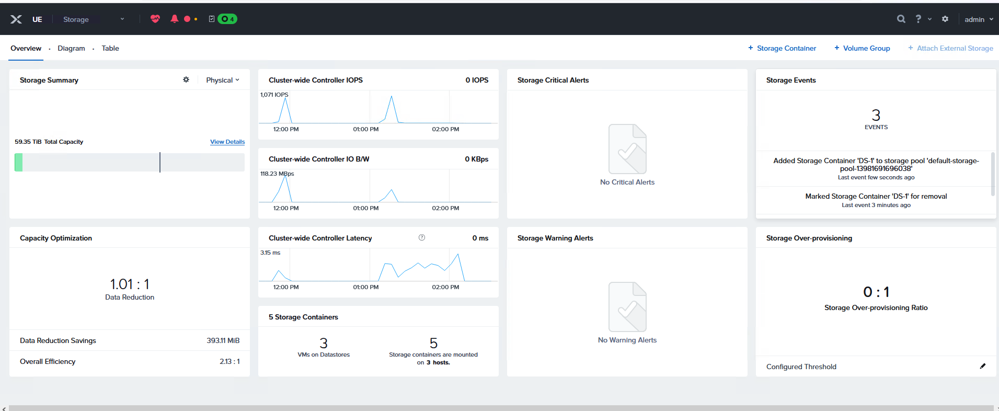
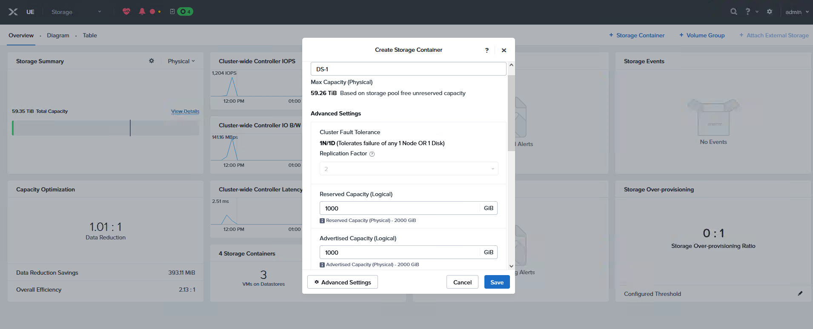
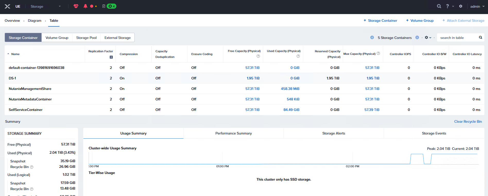
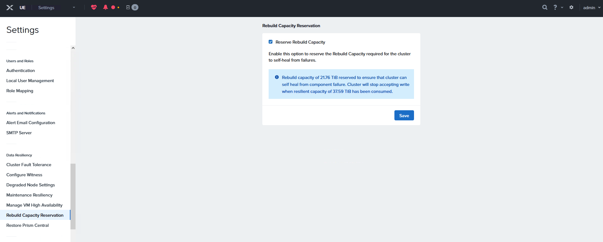
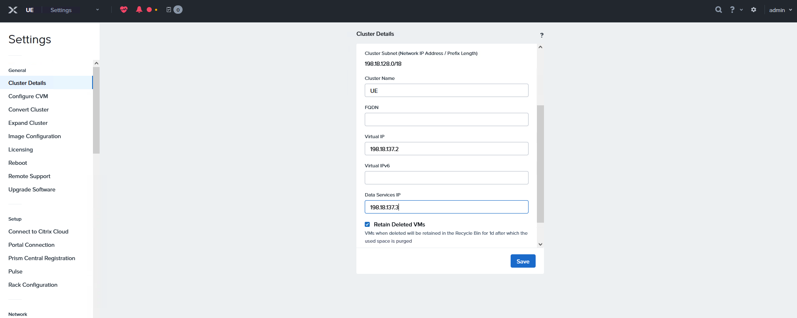
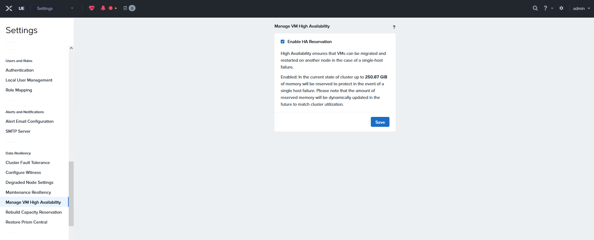
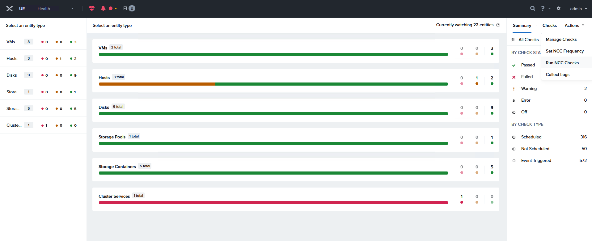
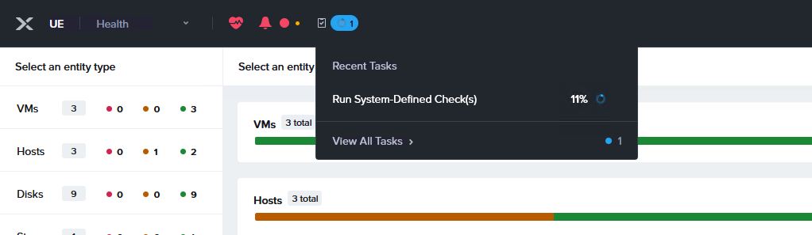

# Scenario 4 	Initial Cluster Configuration

This scenario will take you to the initial configuration required for the cluster

On the recent created cluster and click on Deployment Configuration, there will see the Cluster VIP 198.18.137.2

  

Open a new tab and login to the new Prism 198.18.137.2, admin / nutanix/4u 
Need to create a new password, use C1sco12345!

  

For Nutanix EULA fill the information, check the box and accept and continue
 Name= cpoc
 Company= Cisco
 Job tile= UE

 

Click home at the top, then select storage, then + Storage Container, 

  

Add a name DS-1, click Advanced Settings, under Reserved Capacity add 1000 GB, same as the Advertised Capacity 1000 GB and click Save

  

Click table to view the new DS-1 storage

  

At top dropdown menu, select Settings and click on Rebuild Capacity Reservation

    !!!Note
       Without this setting enabled, cluster will accept incoming writes even if all blocks cannot completely heal during failures.
       
       After enabling, cluster will refuse new writes if they cannot be fully protected during failures

  

In the same settings menu, scroll up and click on Cluster Details and add the Data Service IP 198.18.137.3 and save

 

Then scroll down to Manage VM High Availability, check the box and save and click OK.

  

Remediate all NCC Failures and Warnings

  

Go to Health, Run NCC Checks, click actions and run the checks

  
  

# Deploy and Register Cluster with Prism Central

These instructions assume the Prism Central
instance or cluster used to deploy the Nutanix
cluster will also be the one used long-term for
management. If not, deploy a new Prism Central
instance or cluster on the new Nutanix cluster, then
register that cluster with the Prism Central instance
running on itself.

